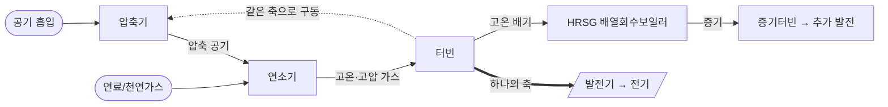
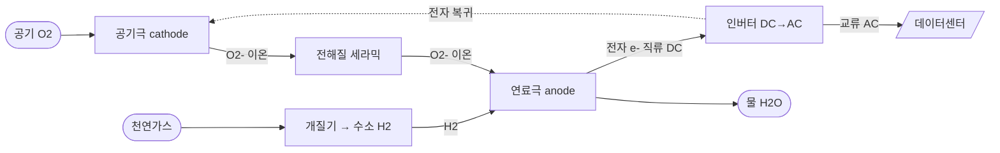
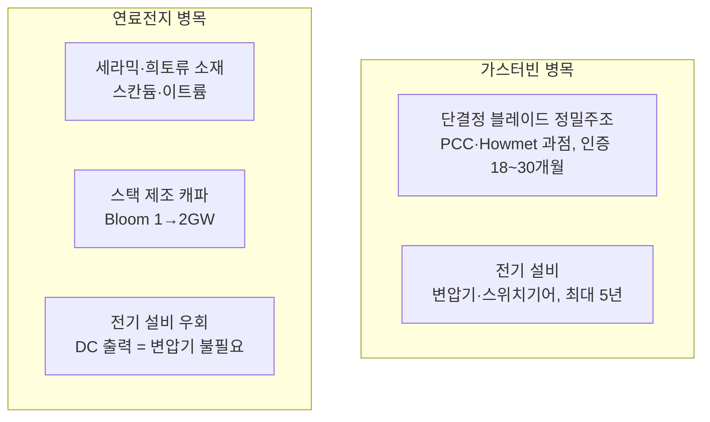
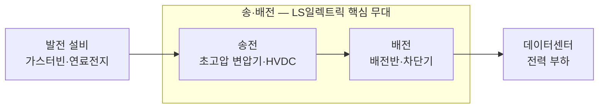

# AI 데이터센터 전력 인프라

> [!summary] 한 줄 요약
> 계통 연결이 5~7년씩 걸리면서 데이터센터가 **전력망을 우회한 자가발전(behind-the-meter)** 으로 이동 중. 발전(가스터빈·연료전지)과 송·배전(변압기·배전반)이 동시에 병목이 되었고, **병목의 위치가 곧 가격 결정력**이다. 핵심은 효율이 아니라 **속도(speed to power)**.

> [!info] 경제학 렌즈 (핵심 관통 논리)
> 리드타임 = 가장 강력한 병목이자 차익거래의 원천. 데이터센터는 **MW당 연 1,000만~1,200만 달러** 매출을 내므로, 가동을 몇 년 앞당기면 수백억 달러 차이. 따라서 발전 효율의 비효율(수백만 달러)은 기꺼이 감수 → 비효율적 대안(왕복엔진, 비전통 공급자)까지 동원됨.

---

## 0. 핵심 요약 (한눈에)

|구분                |핵심 숫자                                        |
|------------------|---------------------------------------------|
|미국 BTM 천연가스 발표 용량 |**~101 GW** (장비 발주 57GW, 건설 7GW)             |
|CCGT 건설비          |<$1,500/kW(2023) → **$2,157/kW**(2025), +66% |
|가스터빈 장비 단가        |2019 대비 +195%(2026말), **$600/kW**(2027말, ≈3배)|
|글로벌 OEM 연 생산능력    |**~60 GW** (수요 대비 부족 = 병목)                   |
|리드타임              |발표→운전 최대 **7년**, 슬롯 2030년대 초까지 매진            |
|가스터빈 시장규모         |$22.6B(2025) → $64.8B(2035), CAGR 11.2% (GMI)|
|Bloom 연료전지 수주     |**90일간 $7.65B** (2026 초)                     |
|LS일렉트릭 1Q26       |매출 1.38조, 영업익 1,266억, **OPM 9.2%**           |
|K전력기기 빅3 OPM(1Q26)|HD현대 **24.9%** > 효성 13.4% > LS 9.2%          |

---

## 1. 큰 그림 — 왜 자가발전(BTM)인가

- 전통적으로 데이터센터는 전력망에 100% 의존 → 최근 계통 대기열이 5~7년으로 폭증.
- 1년 전만 해도 자가발전은 xAI가 멤피스에 이동식 발전기를 트럭으로 들여온 정도의 틈새였으나, 지금은 거의 모든 하이퍼스케일러가 추진하는 주류 전략.
- ERCOT(텍사스)는 2026.3 기준 **약 356 GW**의 데이터센터 연결 요청 접수 → 대기열 압박이 오히려 자가발전을 부추김.
- 글로벌 가스화력 개발 용량 2025년 +31% → **1,047 GW** (텍사스만 80.6 GW). 미국 천연가스 발전 비중 ~43%(2023)→~37%(2024).
- **하이퍼스케일러의 모순**: 100% 재생에너지 목표를 내걸면서도 "녹색의 즉시성"보다 "전력의 속도"를 우선 → 수소 혼소 대응(hydrogen-ready) 가스터빈을 깔며 "미래 전환 가능한" 과도기 플랫폼으로 설계.

---

## 2. 가스터빈

### 2.1 작동 원리 — 브레이튼 사이클 (Brayton cycle)

핵심: **압축 → 연소 → 팽창**, 그리고 **하나의 축(shaft)** 에 압축기·터빈·발전기가 물려 있음. 터빈 회전력의 일부가 다시 압축기를 돌리고, 나머지가 발전기를 돌림.

- **단순 사이클(OCGT)**: 배기를 그냥 버림. 효율 35~45%. 증설·기동 빠름.
- **복합 사이클(CCGT)**: 배기열로 증기 만들어 증기터빈 한 번 더 돌림 → 효율 **63%+** (두 번 돌리기).
- 엔지니어링 난제 = 터빈 블레이드. **합금 융점의 약 90% 온도**에서 작동 → 내부 냉각 채널 필요 → 통짜 가공 불가, **정밀주조(investment casting)** 만 가능.

### 2.2 발전 규모·전력·가격

- **규모(미국)**: BTM 천연가스 발표 ~101 GW (57GW 발주 공개, 7GW 건설). 텍사스 38 GW 최다. (단, 90 GW/59개 프로젝트 중 92%가 2025년 이후 발표 → 상당수 미검증)
- **한 기당 전력**: H/HA급 단순 사이클 약 **380 MW**. (예: 뉴멕시코 Project Jupiter는 단순 사이클만으로 2,880 MW)
- **가격(급등 중)**:

|항목              |2023   |2025/26         |변화                        |
|----------------|-------|----------------|--------------------------|
|CCGT 건설비 ($/kW) |<$1,500|$2,157          |**+66%**                  |
|건설 기간           |기준     |—               |+23%                      |
|가스터빈 장비(2019 대비)|—      |+195%(2026말)    |발전소 원가의 최대 30%            |
|터빈 $/kW         |—      |**~$600(2027말)**|≈2019의 3배 (Wood Mackenzie)|

> [!warning] 병목 = 해자
> 제조 기법상 빠른 증설 불가 → 대기 명단 2030년대 초까지. **공급 제약 자체가 점유율을 방어**. 단, GE Vernova CEO는 "EPC·인허가·연료 조달을 보면 터빈이 진짜 율속 단계는 아닌 경우가 많다"고 언급 → 실제 병목은 **단결정 블레이드 주조 + 전기 설비(변압기·스위치기어)**.

### 2.3 주요 플레이어

- **빅3 = 글로벌 수요의 약 2/3** (각 ~5년치 수주잔고)

|기업                |시총(약)|핵심                                                                                                          |
|------------------|-----|------------------------------------------------------------------------------------------------------------|
|**GE Vernova**    |$162B|가스 백로그+예약 100GW(1Q26)→110GW 목표, 총 백로그 $163.3B, 美 1위, 세계 전력 ~25% 담당, HA급 2030까지 매진. 생산 20GW('26 Q3)→24GW('28)|
|**Siemens Energy**|$91B |사상 최대 백로그 €154B, 대형터빈 연 48→70~80기                                                                           |
|**Mitsubishi HI** |$84B |2년간 생산능력 2배, M701JAC(수소대응) 카타르 2.4GW                                                                        |

- **장비 시장 점유율(2025, GMI)**: GE Vernova 18.5% 선두, 상위 5사(Ansaldo·Mitsubishi·GE·Siemens·Baker Hughes) 64.5%.
- **두산에너빌리티 (한국, 빠른 추격자)**
  - H급 자체 개발 **5번째 국가**. 단순 380MW / 복합 **63%+**.
  - 핵심 무기 = **납기**: 빅3 평균 5년(최대 7년) vs 두산 **1~2년**.
  - 누적 23기(국내 11 + 해외 12), 1Q26만 10기(국내 3 + 美 빅테크 7). 美 발주 5기는 모두 xAI향.
  - 생산능력 연 6 → 8('27) → 12기('28). 2038년 누적 **105기** 목표.
  - 서비스 = 터빈 1기당 연 ~100억 원 × 14년+ (안정적 수익 풀).
- **비전통 대안 (왕복엔진)**: 터빈 못 구한 개발사들이 선택.
  - INNIO–VoltaGrid 2.3 GW(오라클, 25MW×92팩).
  - Titus는 Jenbacher 왕복엔진 채택(급격한 부하변동 관리 유리).
  - 한 개발사는 Boom Supersonic에 $1.25B 발주(발전 제품 무경험사).

### 2.4 세부 시장 — 가치사슬 (소재→부품→시스템→서비스)

진짜 병목은 완제품 OEM보다 **상류의 정밀주조**.

|계층        |세부 시장                        |핵심 플레이어                                              |기회 / 반응                                                    |
|----------|-----------------------------|-----------------------------------------------------|-----------------------------------------------------------|
|소재        |초내열 Ni 초합금 (CMSX-4, Rene N5) |PCC, Howmet, Hitachi Metals                          |Ni·Co·Re 가격 ±20~35% 변동 → 마진 압박; 관세 회피용 저(低)임계원소 합금 R&D     |
|**부품(병목)**|단결정 블레이드·베인 정밀주조             |**Precision Castparts(버크셔), Howmet**, Doncasters, CPP|블레이드 = 엔진 원소재비 **35%**; 단결정 캐파 소수 집중; **인증 18~30개월 = 진입장벽**|
|부품        |열차폐코팅(TBC)·단조 링              |코팅 전문사                                               |초합금+코팅 = 조립 원가 30~45%                                      |
|시스템       |완제품 OEM                      |GE Vernova/Siemens/Mitsubishi/두산                     |가격 결정력 폭발                                                  |
|시스템       |전기 BOP (발전기·HRSG·승압변압기·스위치기어)|GE Vernova 전기화, Prysmian, Powell                     |GE 전기화 수주 2배 $7.1B, DC向 $2.4B(Q1)                          |
|서비스       |LTSA·부품                      |전 OEM                                                |가장 안정적 수익 풀                                                |
|연료        |천연가스 파이프라인                   |Williams, Kinder Morgan                              |On-site 발전의 물리적 전제                                         |

- 단결정 블레이드 시장: $543M(2025)→$865M(2032), CAGR 6.86%.
- 반응: Siemens 블레이드·베인 공장 증설, Caterpillar(Solar) 캐파 2배, Mitsubishi 2배 — 단 2027~28 슬롯 이미 예약.

---

## 3. 연료전지 (SOFC, 고체산화물)

### 3.1 작동 원리 — 회전부도, 연소도 없다

데이터센터용은 대부분 **SOFC**. 가스터빈과 정반대로 **움직이는 부품이 0개**. 연소 없이 화학 반응으로 전기를 직접 추출.

- 공기극에서 산소가 전자 받아 **산소이온(O²⁻)** → 세라믹 전해질 통과 → 연료극에서 수소(개질기가 천연가스 분해)와 만나 물 + 전자 방출.
- 갈 곳 잃은 전자가 **외부 회로**를 도는 것 = 전류(직류 DC) → 인버터로 교류 변환.
- "무엇을 돌리는가" → **아무것도 안 돌림** (이온과 전자만 이동).
- 작동 온도 **800~1000°C** → 고가 세라믹·희토류 필요, 출력이 DC라 인버터 필수.
- 장점: 무연소(NOx·CO 0), 정숙(도심·실내 가능), 효율 50~65%(OCGT 35~45% 대비 10~30%↑).

### 3.2 세부 시장 — 세라믹·희토류·특수합금 의존

|계층        |세부 시장                        |핵심 소재/플레이어                      |기회 / 반응                                                    |
|----------|-----------------------------|--------------------------------|-----------------------------------------------------------|
|**소재(병목)**|세라믹 전해질 (YSZ·ScSZ·GDC)       |지르코니아 + 이트륨/스칸듐/세륨              |**거의 모든 구성요소에 희토류**; 스칸듐은 저온화로 부품비↓; 희토류 분리비용·공급망 = 구조적 리스크|
|소재        |전극 (연료극 Ni-YSZ, 공기극 LSM/LSCF)|니켈+세라믹, 란타넘·스트론튬·코발트            |저온서 저렴한 LSM 쓰려는 소재 최적화                                     |
|부품        |인터커넥트                        |**Plansee** — 크롬-철-이트륨(CFY) 분말야금|특수 금속·분말야금 니치                                              |
|부품        |고온 실링                        |**Schott** — 유리 실링재             |고온 기밀이 수명 관건                                               |
|시스템       |셀·스택 제조·통합                   |**Bloom Energy**(수직통합)          |캐파가 병목: 1→2GW('26말), 라이선싱 가능성                              |
|시스템       |전력변환 (인버터·BOP)               |Vertiv("lightning inverter")    |DC 출력이라 인버터 필수                                             |
|연료        |개질기 + 천연가스(향후 수소)            |동일 가스 인프라                       |녹색수소 $4~6→**$2/kg 미만** 돼야 무탄소 경제성                          |

> [!tip] 변압기 우회 = LS일렉트릭 분석과 직결되는 핵심
> 연료전지는 **저전압 직류 직접 출력** → 고압(HV)·중압(MV) 변압기 **불필요**. 변압기·스위치기어 병목을 통째로 건너뜀. (2026년 미국 DC 12GW 중 착공 5GW뿐, 율속 요인이 HV 변압기·스위치기어 — 전기 설비는 총비용 10% 미만이지만 병목의 100%.) → 오라클 Project Jupiter에서 일부 가스터빈 슬롯 취소·Bloom 전환 정황 포착.

### 3.3 가스터빈 vs 연료전지

|항목                   |가스터빈(단순)|SOFC         |
|---------------------|--------|-------------|
|발전 효율                |35~45%  |**50~65%**   |
|CapEx(명판)            |기준      |10~15%↑      |
|연료 소비                |기준      |15~20%↓      |
|LCOE (가스 $4/MMBtu)   |기준      |~40%↑        |
|LCOE (가스 $13.3/MMBtu)|기준      |대등~7%↓       |
|배출·소음·인허가            |연소·소음 부담|무연소·정숙·인허가 용이|

- **연료전지 경쟁력은 가스 가격에 민감** (美 저가 가스 → 가스터빈 유리 / 유럽·아시아 고가 → 연료전지 유리).
- 채택 이유는 비가격(속도·청정·지역수용성). 자가발전 100% 의존 DC 비중: 1년 전 1% → **2030년 27%**.

### 두 병목 지도 (종합)

---

## 4. 시장 점유율 분석 및 예측

- **시장 규모**: GMI $22.6B(2025)→$64.8B(2035, CAGR 11.2%); Precedence $30.24B→$61.13B(7.29%). 대체로 10년 2배+.
- **EIA**: 가스화력 발전 2026 횡보 → 2027 가속. 근시일엔 태양광이 석탄 점유율 잠식.
- **글로벌 DC 전력**: 2030년 ~4배 1,260 TWh. 천연가스 발전 ~870 TWh로 확대.

> [!abstract] 3가지 예측 (경제학 렌즈)
>
> 1. **2030까지 가스터빈 지배는 거의 확정** — 기술이 아니라 병목 때문. 만들 수 있는 양(~60GW/년)이 한정 → "팔 수 있는 만큼 다 파는" 시장.
> 2. **연료전지는 '대체' 아닌 '확장'** — 둘 다 수주 만석(가스터빈 '29까지), 수요가 양쪽 합쳐도 부족. 단 도심·인허가 까다로운 부지=연료전지, 외곽 저비용=가스터빈으로 분화.
> 3. **장기 리스크 = 효율 곡선 방향** — 태양광·배터리는 싸지고 가스터빈은 비싸짐. 2030년대 중반 병목 풀리고 청정 대안 비용 내려가면 가스 증분 점유율 정점.

- **Goldman**: 2024~30 DC 증분 수요 730 TWh 중 **1/4~1/3을 BTM**, 그중 **연료전지 6~15%**, BTM 최대 25 GW/5년. → 가스터빈이 절대량 쥐되 연료전지가 변압기 우회 강점으로 빠르게 침투.

---

## 5. LS일렉트릭 & K전력기기 빅3

### 5.1 LS일렉트릭이란

- 한마디로 **"발전(가스터빈·연료전지) ~ 부하(데이터센터) 사이를 잇는 송·배전 전력기기 기업"** (= 전기 BOP 계층).
- 주력: 배전반·중저압 차단기·부스덕트(배전) / 초고압 변압기·HVDC 변환기(송전) / PLC·드라이브(자동화) + ESS·EV충전·DC.
- **1Q26**: 매출 1.38조(+33.4%), 영업익 1,266억(+45.3%), **OPM 9.2%**. 전력부문 매출 9,584억(+44.9%).
- 북미 매출 +80%(또는 ~2,400억, +60%), 초고압 변압기 +83%. 수주잔고 5.6조(UHV 3.1조, 55%).
- **데이터센터 국내 점유율 ~70% 1위**, 빅테크 직거래로 '1조 클럽' 진입. hyperscale 계약 $1.15억(1,703억).
- LS파워솔루션: 美 빅테크 DC 마이크로그리드에 345kV 변압기 $7,026만(1,066억) 수주.
- HVDC: 국내 최초 500MW급 전압형 변환기 개발, 누적 ~1조.

### 5.2 전력 가치사슬 위치

- 발전 설비가 만든 전기는 송전(전압↑) → 배전(분배)을 반드시 거쳐 부하로. LS는 **송·배전(T&D) 전체 커버**.
- **구조적 호재**: 美 배전 변압기 70%가 수명(25년) 초과, 송전망 대부분 1950~60년대. + AI DC 신규 수요. + 미국 변압기 **자급률 20%**, 평균 납기 **~143주** → 공급자 우위.
- DC 전력 인프라 시장: 86.5억(2025)→372억 달러(2035), CAGR 16%.

### 5.3 경쟁 구도 ① — 국내 빅3 (가장 직접적)

> [!important] 핵심: 같은 호황이라도 **무엇을 파느냐가 마진을 가른다**

|구분            |LS일렉트릭            |HD현대일렉트릭      |효성중공업         |
|--------------|------------------|--------------|--------------|
|2025 매출       |4.96조             |4.08조         |5.97조(건설 포함)  |
|2025 영업이익     |4,269억            |9,953억        |7,470억        |
|**1Q26 영업이익률**|9.2%              |**24.9%**     |13.4%(중공업)    |
|주력            |배전+자동화, 송전 확대     |**초고압 변압기 집중**|초고압 변압기+건설    |
|해외 비중         |~50%              |60~70%        |60~70%        |
|미국 거점         |유타 MCM·텍사스 Bastrop|앨라배마(최초)      |테네시 멤피스(765kV)|

- **HD현대**: '가장 비싼 시장(북미·중동)에서 가장 비싼 제품(초고압 변압기)을' + **선별 수주** → 애플급 24.9%. 룰메이커 전략.
- **효성**: 멤피스 765kV 미국 최대 거점, 1Q26 수주 4.17조(역대 최대)·잔고 15.1조, 외형 최대 but 건설이 마진 희석.
- **LS**: "넓지만 얕은" 모델. 강점=최광폭 포트폴리오·국내 DC 1위·풀패키지. 약점=해외비중 50%·낮은 마진(고마진 UHV 비중 낮았던 결과). **단 빠르게 보완 중** — 부산 UHV 캐파 2,000억→6,000억(3배), 잔고 내 UHV 비중 41.7%→55%(1.6조→3.1조).

### 5.4 경쟁 구도 ② — 글로벌 메이저 (체급이 다름)

- 지난 30년간 GE·Siemens·ABB 그늘에서 한국 기업은 저가 물량에 만족.
- 스위치기어 톱5(ABB·Siemens·GE·Schneider·Eaton) ~35~40%. DC 전력 톱5(Schneider·Vertiv·ABB·Eaton·Delta) 41~43%.
- 매출 체급: Schneider ~€34.5B, Siemens ~€78B, Eaton ~$27B vs **LS ~5조 원(≈$3.5B)** — 한 자릿수 배 차.
- LS 위치 = **"가성비 아시아 추격자"** (CHINT·Delixi와 동급 분류, 프리미엄 대비 **30~50% 저렴**, 보증·장기신뢰성은 편차). 무기 = 빠른 납기·가격으로 美 공급부족 틈 공략 (2020~25 美 100+ 프로젝트).

### 5.5 객관적 종합 평가

> [!note] 세 한국 기업 = "같은 사이클, 다른 베팅"
> HD현대가 고마진 변압기에 '집중'(최고 수익성)이라면, LS는 '폭'을 택해 DC 한 곳에 송전·배전·자동화를 통째 공급하는 종합 솔루션 지향.

- **강점**: ① 송·배전 포트폴리오 폭(풀패키지) ② 국내 DC 70% 내수 지배력 ③ HVDC·DC 차세대 선제 기술 ④ 美 현지화·가성비.
- **약점/리스크**: ① 낮은 수익성(9.2% vs HD현대 24.9%) ② 낮은 해외비중(50%) ③ 글로벌 대비 작은 체급·브랜드 ④ 빅3 증설 경쟁 → 중장기 공급과잉·주가 부담.
- **관전 포인트**: UHV 비중 끌어올려 **마진 격차를 얼마나 빨리 좁히느냐** + 해외비중을 경쟁사 수준(70%)에 근접시키느냐.

---

## 6. 핵심 투자 관전 포인트 (전체 정리)

1. **병목 = 해자**: 좁은 병목 + 긴 인증 장벽 = 가격 결정력. 단결정 주조(PCC/Howmet), 대형 변압기(5년 리드), 희토류 세라믹, 인터커넥트 특수합금.
2. **서비스가 수익 풀**: 가스터빈 LTSA / 연료전지 스택 교체·O&M = 가장 안정적·반복적.
3. **반응(공급 확장) 전방위**: Siemens·Caterpillar·Mitsubishi·두산·Bloom 모두 증설 → 2030년대 중반 공급과잉 가능성.
4. **가스터빈↔연료전지 슬롯 전환** + 가스 가격 연동 LCOE 역전 지점 + 수소 혼소 상용화 시점.
5. **LS일렉트릭**: UHV 비중 확대 속도 = 마진 리레이팅의 핵심 변수.

---

## 출처 (2026년 6월 기준)

- RBC Capital Markets — Natural gas powers the data center boom (~101GW BTM, 6.1 Bcf/d)
- Cleanview — Behind-the-meter data centers (90GW/59프로젝트, $10–12M/MW)
- BloombergNEF via TechCrunch — CCGT +66%, 터빈 +195%
- SecondWatt / Kroll / Global Energy Monitor — 발전 규모·가격·글로벌 용량
- GE Vernova 1Q26 8-K / Utility Dive / Power-Eng — 백로그 100→110GW, $600/kW
- 미래에셋·서울신문·문화일보·한국금융신문 — 두산에너빌리티
- DCD·Utility Dive·Goldman Sachs·Tech Fund — Bloom Energy, 연료전지 경제성
- GMI·Precedence·Fortune Business Insights — 가스터빈 시장규모
- ResearchAndMarkets·IndexBox·MDPI — 단결정 블레이드·초합금 공급망
- Stanford Materials·Plansee·Metal Powder — SOFC 소재·인터커넥트
- ZDNet·인베스트조선·블로터·데이터뉴스·뉴시스·CBC — K전력기기 빅3
- MarketsandMarkets·GMI — 글로벌 스위치기어·DC 전력 점유율
