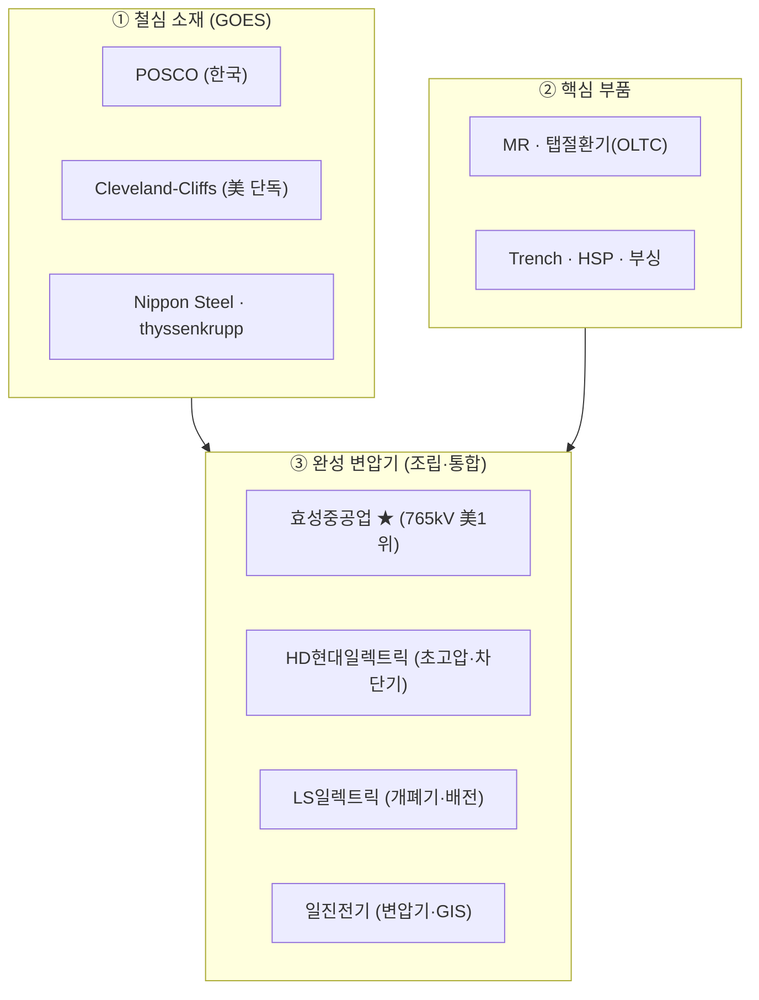

# AI 전력 병목과 변압기 가치사슬

> [!abstract] 한 줄 요약
> AI 데이터센터발 전력 수요 급증으로 **전력이 반도체 다음 병목**이라는 분석은 주류·실증적이다. 단 "전력"은 단일 테마가 아니라 **발전→송전→변압기→데이터센터로 이어지는 10단계 이상의 변환 사슬**이며, 그중 **변압기(특히 765kV 초고압 강압 변압기)가 물리적으로 가장 느린 병목**이다. 병목의 진짜 진앙은 변압기 완성품이 아니라 그 **소재(GOES)·부품(OLTC·부싱)·숙련 인력**에 있다. 효성 등 한국 4사는 "완성품 조립·통합" 층을 차지하지만 핵심 부품은 외부(독일 MR·Trench)에 의존한다.

---

## 1. "전력이 다음 병목"인가 — 명제 검증

### 명제를 지지하는 근거 (주류·실증)

- **IEA**: 데이터센터 전력 소비는 2025년 485 TWh → 2030년 약 950 TWh로 ~2배(전 세계 전력의 약 3%). 2025년 데이터센터 전력 +17%, **AI 전용은 +50%**.
- **미국**: 약 180 TWh(현재) → 2030년 400~600 TWh. LBNL·IEA·EPRI가 **방향엔 동의, 수준엔 이견**.
- **전력망 적체**: 전 세계 **2,500 GW 이상**이 계통 접속 대기열에 묶임. 접속 대기 **5~10년**.
- **투자 갭**: 수요 충족하려면 2030년까지 연간 전력망 투자를 현재 $4,000억에서 **+50%** 필요.
- **Gartner**: 2027년까지 전력 부족으로 AI 데이터센터의 **40%가 제약**.

### 반대편 균형추 (반드시 기억)

- IEA 기본 시나리오는 오히려 신중: **밸류체인 병목이 공격적 단기 시나리오의 실현 가능성을 낮춘다**(Headwinds Case). "전력이 병목"은 곧 "병목이 AI 확장을 제약한다"는 양날의 칼.
- 금융시장은 **AI capex가 수익화보다 앞서 달린다**는 우려 → 이것이 "AI 버블" 논쟁의 핵심.

> [!important] 명제의 정확한 재구성
> "전력이 병목인가?"가 아니라 **"여러 하위 병목 중 무엇이·어디서·얼마나 오래 구속력을 갖는가?"** 가 진짜 질문이다.

---

## 2. 전력 가치사슬 — 발전 → 송전 → 배전 → 데이터센터

### 전압 변환의 원리 (왜 고전압으로 송전하나)

- 전력 P = V × I. 전선 손실은 전류의 제곱(I²R)에 비례.
- → **전압을 높이고 전류를 낮추면 손실 급감.** 그래서 발전(~20kV대) → **승압**(345~765kV) → 장거리 송전 → **강압** → 배전 → 사용.

### 단계별 주요 플레이어 (요약)

| 단계 | 대표 플레이어 |
|---|---|
| 발전 — 가스터빈 | GE Vernova, Siemens Energy, Mitsubishi Heavy, **두산에너빌리티** |
| 발전 — 원자력/SMR | Constellation, Vistra, Talen, Oklo, NuScale, BWXT |
| 발전 — 연료전지 | Bloom Energy |
| 송전·계통 건설 | Quanta Services, MasTec |
| **변압기·고압기기** | **한국 4사**, Eaton, GE Vernova(Prolec), Hitachi Energy, ABB, Schneider |
| 데이터센터 내부(UPS·냉각) | Vertiv, Schneider, Eaton, Delta, Legrand |
| 전력 반도체 | Infineon, STM, Navitas, Monolithic Power(MPS) |

> [!note] 병목의 "두더지 잡기" 구조
> 변압기·계통 접속을 5년씩 기다리느니 부지 자가발전(**BYOP, Bring Your Own Power**)으로 우회 → 그러나 가스터빈도 대기 5~7년 → Bloom 연료전지 독립형으로 또 전환. **병목이 발전→송전→변압기→자가발전→연료전지로 계속 이동.**

---

## 3. 변압기 원리 — 왜 전압을 올리고 내릴 수 있나

핵심은 **패러데이의 전자기 유도**("변하는 자기장은 전압을 만든다").

1. 철심(코어)에 1차·2차 코일을 감음.
2. 1차에 **교류(AC)** 전류 → 변하는 **자속 Φ**가 철심을 따라 흐름(철심 = 자기 고속도로).
3. 2차 코일이 변하는 자속을 맞아 전압 유도.
4. **모든 한 바퀴(turn)는 같은 자속을 봄** → 한 바퀴당 전압이 1·2차에서 동일.

> [!formula] 핵심 관계식
> V₁/V₂ = N₁/N₂ (전압비 = 권선비)
> V₁I₁ = V₂I₂ (전력 보존)
> 전압을 올리면 전류가 내려감 → 저압측은 전류가 커서 **도선이 굵다**.

- **AC에서만 작동**: 유도엔 "변하는" 자속이 필요. DC는 자속이 일정 → 변압 불가. (전 세계 전력망이 AC인 근본 이유. HVDC가 특수 취급받는 이유.)
- **손실과 효율** (소재 병목으로 직결):
  - **철손(코어 손실)**: 히스테리시스 + 와전류. → 철심을 얇게 라미네이션 + 결정 정렬한 **방향성 전기강판(GOES)** 사용.
  - **동손(권선 손실)**: 구리 저항 I²R.
  - 대형 전력변압기 효율 **99.5%+**. 강판 손실 **1% 개선 시 소재비 +3~4%, 무부하손실 −10%** → 효율 규제 강화 = 고급 GOES 수요 증가.

---

## 4. 변압기 구성 부품

| 부품 | 역할 | 공급망 성격 |
|---|---|---|
| **철심(코어)** | 자속 통로 | **GOES**, 소재 병목의 핵심. 단가의 큰 비중 |
| **권선(코일)** | 전류 경로 | 구리(또는 알루미늄). **구리+규소강판 = 소재비 50%+** |
| **절연 시스템** | 코일·철심 절연 | 절연지·프레스보드 + 절연유(광유→친환경유 전환) |
| **부하시 탭절환기(OLTC)** | 운전 중 전압 미세조정 | **유일한 부하 동작 부품**, 부품 단위 초크포인트 |
| **부싱(bushing)** | 고압 도체의 탱크 관통 절연 | 인증 필요, 자격 공급자 소수 |
| **냉각·탱크·보호** | 라디에이터·팬·펌프, 보존기, 부흐홀츠 계전기 | — |

---

## 5. 부품별 병목 구속력 분석

> [!tip] 분석 프레임
> **"변압기 제작은 가장 느린 부품의 속도로만 진행된다"** = 리비히 최소량의 법칙(제약이론). 구속력은 ① 공급 집중도(단일 실패점?) ② 부족의 심도 ③ 구조적 vs 일시적(해소 경로) 세 축으로 본다.

### 스코어카드

| 투입/부품 | 공급 집중도 | 현재 구속력 | 성격·해소 경로 |
|---|---|---|---|
| **방향성 전기강판(GOES)** | 극히 높음 — 美 Cleveland-Cliffs 단독, 글로벌도 소수 | 🔴 매우 높음 | 구조적·지정학적, 수년 지속 |
| **부하시 탭절환기(OLTC)** | 매우 높음 — MR ~40% | 🔴 높음 | 부품 단위 초크포인트, 완만 |
| **고압 부싱** | 높음 — 인증된 소수 공급자 | 🔴 높음 | 단일 지연이 전체 제작 보류 |
| **숙련 인력** | — (양성 수년) | 🔴 매우 높음 | OEM 증산 못 하는 1순위 이유 |
| **구리 권선** | 중간 — 글로벌 거래되나 가공 특수 | 🟠 중–높음 | 주로 가격·관세 문제 |
| **제조 캐파(공장)** | 과점 | 🟠 높음(현재) | 대규모 증설 → 2027~2030 완화 |
| **절연유·절연지** | 중간 | 🟡 중간 | 친환경유 전환 비용 |

### 항목별 메모

- **GOES** — 단순 부족이 아닌 **단일 공급원** 문제. 美는 Cleveland-Cliffs(Butler PA·Zanesville OH) 단독, 글로벌도 Nippon Steel·POSCO·thyssenkrupp 등 극소수. **2020년 이후 가격 ~2배**(구리 +50%). 아몰퍼스강 대체는 의존성을 해소가 아니라 **재배치**할 뿐 → 잠재적 지정학 초크포인트.
- **OLTC·부싱** — 양은 작지만 **구속력 비대칭**. 둘 중 하나만 지연돼도 전체 변압기 제작 정지. OLTC는 **MR 38~42%**(UHV급 대당 $25만+). 부싱은 인증·소수 공급.
- **숙련 인력** — **자본으로 못 사는 병목**. 맞춤 설계·수작업 비중↑, 양성 수년. 공장 지어도 사람 못 채우면 캐파 안 늘어남.
- **구리** — 절대 희소성보다 **가격·정책**(美 50% 구리 관세) 성격.
- **제조 캐파** — 현재 리드타임 **4년**, GSU 수요 2019~2025 **+274%**. 단, Hitachi($10억+, 2028), Siemens(노스캐롤라이나), Eaton(사우스캐롤라이나 $3.4억), Prolec($3억+), HD현대(앨라배마) 대규모 증설. → **Wood Mackenzie: GSU 변압기 공급 부족 ~100%(2025) → 2030년 10% 미만 전망.**

> [!warning] 반대 신호 (기록)
> 일부는 부족이 과장됐다고 봄(중개업체 Bolt Electrical: 표준 변전소용 변압기는 도면 승인 후 **12~14개월** 가능). → **병목은 "표준품"이 아니라 "맞춤형·고전압·대형" 구간에 집중**. 종목 분석 시 결정적 경계선.

---

## 6. 기업 매핑 — 누가 어느 층에 기여하나

- **① 소재(GOES)** — 철강사의 영역. **POSCO**(Hyper GO ≤0.85 W/kg, High GO ≤1.05 W/kg)가 국내 공급원 → 美(Cliffs 단독) 대비 한국의 구조적 이점. 단 POSCO와 효성은 **별개 회사**(그룹 수직통합 아님).
- **② 핵심 부품** — **OLTC=MR(독일), 부싱=Trench·HSP(독일)**. **효성조차 765kV 부싱은 자체 생산하지 않고 Trench/HSP에서 조달**(2026.5 CWIEME 베를린 공급계약). 효성은 **35kV 이하 배전급은 자체 부싱·OLTC** 생산, 초고압은 외부 의존.
- **③ 완성 변압기** — 한국 4사의 본진. 소재·부품을 받아 수백 톤 완성품으로 **설계·조립·통합**. 지금 병목이 가장 세고 가격결정력이 가장 높은 "맞춤형 765kV 완성품" 구간.
- **글로벌 풀라인(②③ 수직통합)** — Hitachi Energy·Siemens·GE Vernova(Prolec)·Eaton은 부품과 완성품을 모두 안에서 함. → **부품 병목에서 상대적으로 보호받음.**

> [!important] 핵심 구도
> 한국 4사는 **"조립·통합"이라는 가장 가시적이고 지금 가장 비싼 칸**을 차지하지만, **가장 구조적인 해자(GOES·MR OLTC·Trench 부싱)는 다른 회사가 쥐고 있다.** 효성이 765kV 부싱을 Trench에서 사 온다는 사실 = 그들은 병목을 벗어난 게 아니라 **병목의 바로 하류**에 앉아 있음. GOES 부족·Trench 지연은 효성도 똑같이 타격.

### 한국 4사 내부 분업

- **효성중공업 / HD현대일렉트릭** = 초고압(765kV) 변압기 본류 (효성: 美 765kV 점유 1위, 2010년대 초부터).
- **HD현대일렉트릭** = + 고압 차단기, 회전기기.
- **LS일렉트릭** = 개폐기(switchgear)·배전 특화, AWS 데이터센터향, AC→DC 확장.
- **일진전기** = 변압기 + 케이블 + 가스절연개폐장치(GIS).

---

## 7. 투자 관점 정리 & 판단 질문

> [!summary] 두 갈래의 베팅
>
> - **완성품 희소성 레버리지** = 한국 4사. 지금 가격결정력 최고, 그러나 ①②의 업스트림 병목 + 2027~2030 캐파 정상화에 노출.
> - **가장 구조적인 해자** = MR(OLTC)·Trench(부싱)·Cliffs/POSCO(GOES). 단, MR·Trench는 **독일 비상장**, 나머지는 대형 다각화 기업(POSCO·Nippon·Hitachi) → 접근 경로가 다름.

### 끝까지 들고 가야 할 판단 질문

1. **해자의 내구성** — 어디가 진짜 구조적 과점이고, 어디가 자본만 있으면 진입 가능한가?
2. **진짜 부족 vs 일시적 수급 불균형** — 2028~2030 증설이 따라잡으면 가격결정력은 어디서 유지/붕괴되나? (구조적: GOES·MR·인력·765kV 맞춤 / 일시적: 범용 캐파)
3. **밸류에이션 반영** — 이미 폭등(GE Vernova +178%, Oklo +167%, 효성 "황제주"). 어디까지 펀더멘털이고 어디부터 기대인가?
4. **버블 질문** — capex가 AI 수익화를 앞서 달린다면, 장기 수주잔고는 얼마나 버티나? (경제학도가 가장 잘 다룰 질문)

### 다음 액션 후보

- [ ] GOES 소재 사슬 심화: POSCO·Cliffs·Nippon 경쟁구도와 한국의 위치 → [[GOES 방향성 전기강판]]
- [ ] 부품 전문사(MR·Trench) 해자와 접근 가능한 상장 경로
- [ ] 한국 4사 비교: 부품 내재화율 · 美 익스포저 · 밸류에이션
- [ ] "맞춤형 vs 표준품" 경계로 종목별 노출도 분류

---

## 관련 노트

- [[반도체 가치사슬]]
- [[AI 데이터센터]]
- [[GOES 방향성 전기강판]]
- [[가스터빈 병목]]
- [[원자력 SMR]]
- [[효성중공업]]
- [[Ray Dalio 프레임워크]]

---

## 출처 (확인일 2026-06)

- IEA, *Energy and AI* / *Electricity 2026* (2026)
- Wood Mackenzie, 변압기 공급망 분석 (2025~2026); Electrical Trader 재인용 — GSU 부족 100%→<10%(2030)
- pv magazine / PwC — 고용량 변압기 리드타임 4년 (2026.5)
- CWIEME Berlin — 부싱·OLTC 부품 병목 (2026.3)
- dataintelo / marketintelo — MR OLTC 점유 38~42% (2026)
- POSCO PRODUCTS — 전기강판(GO) 등급 규격
- 더구루 — 효성중공업·Trench 그룹 765kV 부싱 공급계약 (2026.5)
- KED Global / Korea Times / Seoul Economic Daily / Businesskorea — 한국 전력기기 4사 수주·실적 (2026.4~5)
- GE Vernova 8-K — 가스터빈 수주잔고 (2026 Q1)
- Gartner (enkiai 재인용) — 2027년 AI DC 40% 제약

> [!quote] 메타 노트
> 본 노트는 Claude와의 4턴 심층 대화(2026-06-23)를 정리한 것. 투자 자문이 아니라 자체 분석용 사실 정리. 수치는 위 출처 기준이며 시점에 따라 변동 가능.
