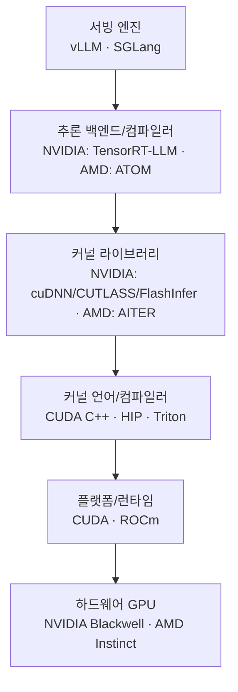

> 원본 학습 노트 (Luke). 불변 보존. 해석·정제는 `wiki/concepts/llm-serving-stack.md` 참조.

# LLM 서빙 스택 — 복습 정리 & 개념 교정

> 핵심 한 줄: 내가 "프레임워크"라고 묶었던 단어들은 사실 **하드웨어 → 플랫폼 → 커널 → 추론 백엔드 → 서빙 엔진**으로 이어지는 **서로 다른 계층**이다. 이 계층 구분이 전체 그림을 푸는 열쇠다.

-----

## 1. 내 복습 내용 점검 (✅ 맞음 / ⚠️ 보완 / ❌ 교정)

| 내가 적은 내용 | 판정 | 설명 |
|---|---|---|
| 가중치는 VRAM에 있다가 연산 유닛 옆 SRAM으로 가서 행렬 계산 | ✅ | 정확. VRAM = HBM. 메모리 계층은 **HBM(VRAM) → L2 캐시 → L1/Shared Memory(SRAM) → 레지스터 → Tensor Core** 순. decode 단계의 메모리 대역폭 병목이 바로 이 HBM→SRAM 이동 비용에서 나온다. |
| GPU를 돌리려면 CUDA 라이브러리로 코드를 작성 | ✅ | 대체로 맞음. 정확히는 CUDA는 **플랫폼**(드라이버 + 런타임 + 컴파일러 nvcc + 기본 라이브러리)이다. 커널을 직접 작성하거나, 상위 라이브러리를 쓴다. |
| 칩 회사마다 지원 프레임워크가 다르다 / CUDA로 AMD 칩 못 돌린다 | ✅ | 정확. NVIDIA = CUDA, AMD = ROCm. AMD의 CUDA 대응 언어는 **HIP**. (CUDA 코드를 HIP로 변환하는 hipify는 가능하지만, CUDA 바이너리를 AMD에서 그대로 실행하진 못한다.) |
| 나열한 단어들이 "서빙 프레임워크" | ❌ | **가장 중요한 교정.** 이들은 서로 다른 계층이다. → 2번 표 참고. |
| B200/B300/GB300/A100 = NVIDIA, M~ = AMD | ⚠️ | 칩 분류는 맞음. 단 **GB300은 단일 GPU가 아니라 Grace CPU + Blackwell GPU 슈퍼칩/랙 시스템**(GB = Grace+Blackwell). **A100은 구세대(Ampere, 2020)**로 최신 라인업과는 거리가 있음. AMD는 "M~"이 아니라 정확히 **MI(Instinct) 시리즈**. |
| 새 모델은 KV 캐시를 새 구조로 관리 → 기존 GPU로 서빙이 어렵다, 커널 작성 필요 | ⚠️ | 방향은 정확. 단 "기존 GPU로 못 돌린다"가 아니라 **하드웨어로는 돌아가지만 최적 성능을 내려면 전용 커널이 필요하다**가 정확. → 5번 참고. |
| CUDA는 vLLM/SGLang 같은 성숙한 라이브러리 보유, AMD는 그만큼 성숙한 라이브러리가 없음 | ⚠️ | 핵심(생태계 해자, day-0 지원은 보통 NVIDIA 먼저)은 맞음. 단 **vLLM/SGLang은 "CUDA 라이브러리"가 아니라 서빙 엔진**이며, 이제 **ROCm도 지원**한다. AMD는 AITER(커널) + ATOM(추론 백엔드)으로 빠르게 격차를 메우는 중. → 6번 참고. |

-----

## 2. ⭐ 핵심 교정: "프레임워크"가 아니라 "계층(layer)"

내가 나열한 단어들을 계층별로 다시 배치하면:

| 계층 | 역할 | NVIDIA | AMD |
|---|---|---|---|
| **① 하드웨어** | GPU 그 자체 | A100, B200, B300, GB300 | MI300X, MI325X, MI350X, MI355X |
| **② 플랫폼/런타임** | 드라이버 + 런타임 + 컴파일러 + 기본 라이브러리 | **CUDA** (cuDNN, cuBLAS, CUTLASS, NCCL) | **ROCm** (HIP, MIOpen, rocBLAS, RCCL) |
| **③ 커널 언어/컴파일러** | 커널을 직접 작성하는 도구 | CUDA C++, **Triton** | HIP, **Triton** |
| **④ 커널 라이브러리** | 최적화된 연산자(Attention, GEMM, MoE) 모음 | cuDNN, CUTLASS, FlashInfer | **AITER** |
| **⑤ 추론 컴파일러/백엔드** | 모델 그래프 최적화·실행 | **TensorRT, TensorRT-LLM(TRT-LLM)** | **ATOM** |
| **⑥ 서빙 엔진** | 스케줄링·배칭·KV 캐시 관리·API | **vLLM, SGLang** | **vLLM, SGLang** (+ ATOM 플러그인) |
| **(직교) 양자화 기법** | 메모리·연산량 절감 | Atom(4bit), AWQ, GPTQ, FP8/FP4 | 동일 기법 + MXFP4/MXFP6 |

> **Triton은 NVIDIA·AMD 양쪽을 타깃할 수 있는 크로스 플랫폼 커널 언어**라는 점이 포인트. CUDA 종속을 벗어나려는 핵심 도구다.

### 계층 흐름도

-----

## 3. 나열한 단어 — 정확한 분류

- **CUDA** — NVIDIA의 플랫폼(②). 생태계 해자의 본체.
- **ROCm** — AMD의 CUDA 대응 플랫폼(②). *서빙 프레임워크가 아님.* 런타임·컴파일러·HIP·rocBLAS 등 포함.
- **Triton** — OpenAI가 만든, Python에 임베드된 GPU 커널 작성용 DSL/컴파일러(③). 크로스 플랫폼.
- **AITER** (AI Tensor Engine for ROCm) — AMD의 고성능 연산자(커널) 라이브러리(④). Attention·GEMM·MoE 등 최적화 커널 제공. NVIDIA의 cuDNN/CUTLASS 대응.
- **ATOM** — *주의: 동음이의.*
  - (AMD 맥락) AMD의 ROCm용 오픈소스 LLM 추론 백엔드(⑤). vLLM·SGLang에 플러그인으로 붙어 AMD 최적화 커널을 끼워 넣음. → **나열 맥락상 이쪽일 가능성 높음.**
  - (학계) "Atom: Low-bit Quantization" 논문의 4비트 양자화 기법. 위와 완전히 별개.
- **SGLang** — 서빙 엔진(⑥). 구조화 생성(structured generation)에 강점. CUDA·ROCm 모두 지원.
- **vLLM** — 서빙 엔진(⑥). PagedAttention으로 KV 캐시를 페이지 단위로 관리. CUDA·ROCm 모두 지원.
- **TensorRT** — NVIDIA의 범용 딥러닝 추론 최적화 컴파일러/런타임(⑤). 그래프 최적화·커널 퓨전.
- **TRT-LLM (TensorRT-LLM)** — TensorRT 위에 얹은 LLM 특화 라이브러리(⑤). in-flight batching, paged KV 등 LLM 전용 최적화.

-----

## 4. GPU 라인업 정리

### NVIDIA

| 칩 | 아키텍처 | 메모리 | 비고 |
|---|---|---|---|
| A100 | Ampere (2020) | 40/80GB HBM2e | **구세대.** 최신 추론용은 아님 |
| (H100/H200) | Hopper | 80/141GB | A100과 Blackwell 사이 세대 |
| B200 | Blackwell | 192GB HBM3e | ~9 PFLOPS FP4, 1,000W |
| B300 (Blackwell Ultra) | Blackwell Ultra | 288GB HBM3e (12단) | ~15 PFLOPS FP4, **1,400W**, 추론·추론형 reasoning 특화. FP64는 대폭 축소 |
| GB300 (NVL72) | Grace+Blackwell | 랙 단위 | **단일 GPU 아님.** Grace CPU + B300 GPU 슈퍼칩 72개를 묶은 랙 시스템 |

> 다음 세대: **Rubin (R100)** 예정.

### AMD (Instinct = "MI" 시리즈, CDNA 아키텍처)

| 칩 | 아키텍처 | 메모리 | 비고 |
|---|---|---|---|
| MI300X | CDNA 3 (2023) | 192GB HBM3 | |
| MI325X | CDNA 3 (2024) | 256GB HBM3E | |
| MI350X / MI355X | **CDNA 4 (2025.6)** | **288GB HBM3E, 8TB/s** | MXFP6·MXFP4 지원. MI355X는 액체냉각 고밀도 버전 |

> 다음 세대: **MI400 (CDNA 5, HBM4)** + "Helios" 랙 아키텍처 예정.

**관전 포인트:** B300과 MI355X가 둘 다 288GB HBM3E / 8TB/s로 메모리 스펙이 정면 충돌. 결국 승부는 하드웨어 스펙보다 **소프트웨어 스택 성숙도(②~⑥ 계층)**에서 갈린다 → 이게 "CUDA 해자" 논점.

-----

## 5. "새 모델 → 새 커널"이 왜 필요한가 (KV 캐시 / 어텐션)

- 트랜스포머 추론은 **prefill(프롬프트 일괄 처리) → decode(토큰 1개씩 생성)** 두 단계.
- decode는 과거 토큰의 K·V를 재사용하기 위해 **KV 캐시**에 저장 → 매 스텝 HBM에서 읽어옴 → **메모리 대역폭 병목**의 핵심.
- 새 모델이 **새로운 어텐션 구조**를 쓰면, KV 캐시의 *모양·접근 패턴*이 달라진다. 기존 어텐션 커널(예: FlashAttention)은 이 구조를 그대로 처리하지 못함 → **전용 커널을 새로 작성**해야 최적 성능이 난다.
- **대표 예: DeepSeek의 MLA (Multi-head Latent Attention)**
  - KV를 저차원 latent 벡터로 **압축**해서 KV 캐시 용량을 크게 줄임.
  - 대신 표준 커널로는 안 돌아가서, 벤더마다 **전용 MLA decode 커널**을 따로 만듦 (AMD는 AITER의 MLA decode 커널, NVIDIA 쪽은 FlashMLA 등).
  - DeepSeek 계열은 이후 sparse attention 계열로도 확장 → 그때마다 커널 재작성 압력 발생.
- **정리:** 하드웨어(GPU)는 그대로 쓸 수 있다. 바뀌는 건 ②~⑤ 계층의 **소프트웨어/커널**. "기존 GPU로 못 돌린다"가 아니라 **"day-0엔 비효율적으로 돌고, 전용 커널이 나와야 제 성능"**이 정확한 표현.

-----

## 6. "CUDA 해자(moat)" — 정확한 뉘앙스

- 맞는 부분: **새 모델 day-0 지원은 보통 NVIDIA(CUDA) 생태계가 먼저.** vLLM·SGLang·TRT-LLM·FlashInfer 등 커널·엔진이 성숙.
- 교정/업데이트:
  - vLLM·SGLang은 CUDA 전용이 아니라 **ROCm도 공식 지원** (AMD가 적극 기여).
  - AMD는 더 이상 "라이브러리가 없는" 상태가 아니라, **AITER(커널) + ATOM(추론 백엔드)**으로 빠르게 추격 중. 신모델(DeepSeek 등) 대응 사례가 누적되고 있음.
  - 따라서 해자는 *존재하지만 좁아지는 중*. 투자 관점에선 "격차가 유지되는가 vs 좁혀지는가"의 속도가 관전 포인트.

-----

## 7. 추가로 알아두면 좋은 관련 개념

- **HIP** — AMD의 CUDA 대응 C++ 런타임/언어. CUDA 코드를 HIP로 포팅(hipify) 가능.
- **NCCL / RCCL** — GPU 간 통신 라이브러리 (NVIDIA / AMD). 분산 추론·학습의 집합통신.
- **cuBLAS / rocBLAS** — 행렬곱(GEMM) 라이브러리.
- **cuDNN / MIOpen** — 딥러닝 기본 연산 라이브러리.
- **CUTLASS** — NVIDIA의 GEMM 커널 템플릿 라이브러리(커스텀 커널 작성 기반).
- **FlashAttention / FlashInfer** — 어텐션을 SRAM 친화적으로 재구성해 메모리 병목을 줄이는 커널.
- **PagedAttention** — vLLM이 도입. KV 캐시를 OS 가상메모리처럼 페이지 단위로 관리해 단편화 제거.
- **in-flight / continuous batching** — 요청을 토큰 단위로 동적 배칭해 GPU 활용도 극대화.
- **Composable Kernel (CK)** — AMD의 커널 빌딩 블록 라이브러리(AITER가 활용).
- **MoRI / ATOMesh** — AMD 스택의 통신(RDMA) 계층 / 서빙 오케스트레이션 계층.
- **양자화 데이터타입** — FP8, FP4, NVFP4(NVIDIA), MXFP4/MXFP6(AMD·OCP 표준). 메모리 병목 시대의 핵심 무기.

-----

### 핵심 요약 (다시 한 줄)

GPU(①)는 같아도, 그 위의 **CUDA vs ROCm(②) → 커널 라이브러리(④) → 서빙 엔진(⑥)** 스택의 성숙도가 "새 모델을 얼마나 빨리·효율적으로 서빙하느냐"를 결정한다. 새 어텐션/KV 구조는 ④ 커널 계층에 재작성 부담을 준다. 이 부담을 누가 더 빨리 흡수하느냐가 NVIDIA 해자 vs AMD 추격의 본질.
