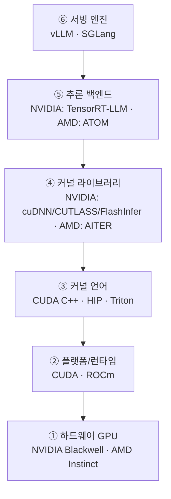

# LLM 서빙 스택 — 계층 구조

> [!summary] 한 줄 요약
> `CUDA·ROCm·Triton·AITER·ATOM·vLLM·SGLang·TensorRT-LLM` 은 **나란히 경쟁하는 "서빙 프레임워크"가 아니다.** 이들은 **하드웨어 → 플랫폼/런타임 → 커널 언어 → 커널 라이브러리 → 추론 백엔드 → 서빙 엔진** 으로 이어지는 **서로 다른 계층(layer)**이다. 이 계층 구분이 "NVIDIA 해자 vs AMD 추격"이라는 투자 논점을 푸는 열쇠다.

> [!fact] 사실 — 핵심 교정
> 같은 줄에 묶어 외우던 단어들이 실제로는 다른 층에 속한다. 예: **CUDA/ROCm = 플랫폼(②)**, **Triton = 커널 언어(③)**, **AITER = 커널 라이브러리(④)**, **TensorRT-LLM/ATOM = 추론 백엔드(⑤)**, **vLLM/SGLang = 서빙 엔진(⑥)**. 서빙 엔진은 백엔드·커널을 호출하는 **최상위**이지, CUDA와 같은 층이 아니다.

---

## 1. 6계층 + 직교 축

| 계층 | 역할 | NVIDIA | AMD |
|---|---|---|---|
| **① 하드웨어** | GPU 그 자체 | A100, B200, B300, GB300 | MI300X, MI325X, MI350X, MI355X |
| **② 플랫폼/런타임** | 드라이버 + 런타임 + 컴파일러 + 기본 라이브러리 | **[CUDA](cuda.md)** (cuDNN, cuBLAS, CUTLASS, NCCL) | **ROCm** (HIP, MIOpen, rocBLAS, RCCL) |
| **③ 커널 언어/컴파일러** | 커널을 직접 작성하는 도구 | CUDA C++, **Triton** | HIP, **Triton** |
| **④ 커널 라이브러리** | 최적화 연산자(Attention·GEMM·MoE) 모음 | cuDNN, CUTLASS, FlashInfer | **AITER** |
| **⑤ 추론 컴파일러/백엔드** | 모델 그래프 최적화·실행 | **TensorRT, TensorRT-LLM** | **ATOM** |
| **⑥ 서빙 엔진** | 스케줄링·배칭·KV 캐시 관리·API | **vLLM, SGLang** | **vLLM, SGLang** (+ ATOM 플러그인) |
| **(직교) 양자화** | 메모리·연산량 절감 | AWQ, GPTQ, FP8, NVFP4 | 동일 + MXFP4/MXFP6 (OCP 표준) |

> [!info] Triton — 크로스 플랫폼이 포인트
> Triton(OpenAI)은 Python에 임베드된 커널 작성 DSL/컴파일러로 **NVIDIA·AMD 양쪽을 타깃**한다. CUDA 종속을 벗어나려는 핵심 도구이며, 그래서 ③ 계층에 NVIDIA·AMD 공통으로 등장한다.

---

## 2. 용어 — 어느 층, 무슨 역할

> [!fact] 사실 — 계층별 정의
> - **CUDA** — NVIDIA 플랫폼(②). 생태계 해자의 본체. → [CUDA](cuda.md)
> - **ROCm** — AMD의 CUDA 대응 플랫폼(②). 런타임·컴파일러·HIP·rocBLAS 포함. *서빙 프레임워크가 아니다.*
> - **HIP** — AMD의 CUDA 대응 C++ 언어/런타임. CUDA 코드를 hipify로 포팅 가능(바이너리 직접 실행은 불가).
> - **Triton** — 크로스 플랫폼 커널 작성 DSL/컴파일러(③).
> - **AITER** (AI Tensor Engine for ROCm) — AMD 고성능 연산자 커널 라이브러리(④). Attention·GEMM·MoE 최적화. NVIDIA cuDNN/CUTLASS 대응.
> - **TensorRT / TensorRT-LLM** — NVIDIA 추론 컴파일러(⑤). TRT-LLM은 in-flight batching·paged KV 등 LLM 특화.
> - **ATOM** (AMD 맥락) — ROCm용 오픈소스 LLM 추론 백엔드(⑤). vLLM·SGLang에 플러그인으로 붙어 AMD 최적화 커널 주입.
> - **vLLM** — 서빙 엔진(⑥). PagedAttention으로 KV 캐시를 페이지 단위 관리. CUDA·ROCm 지원.
> - **SGLang** — 서빙 엔진(⑥). 구조화 생성(structured generation)에 강점. CUDA·ROCm 지원.

> [!warning] 동음이의 주의 — "ATOM"
> **(a)** AMD ROCm 추론 백엔드 ATOM(⑤)과 **(b)** 학계의 "Atom: Low-bit Quantization"(4비트 양자화 기법)은 **완전히 별개**다. 서빙 스택 문맥에서는 보통 (a).

---

## 3. GPU 라인업 — 세대 구분

> [!fact] 사실 — NVIDIA
> | 칩 | 아키텍처 | 메모리 | 비고 |
> |---|---|---|---|
> | A100 | Ampere (2020) | 40/80GB HBM2e | **구세대.** 최신 추론용 아님 |
> | H100/H200 | Hopper | 80/141GB | A100과 Blackwell 사이 |
> | B200 | Blackwell | 192GB HBM3e | ~9 PFLOPS FP4, 1,000W |
> | B300 (Blackwell Ultra) | Blackwell Ultra | 288GB HBM3e | ~15 PFLOPS FP4, ~1,400W, reasoning 추론 특화 |
> | GB300 (NVL72) | Grace+Blackwell | 랙 단위 | **단일 GPU 아님** — Grace CPU + B300 GPU 슈퍼칩 72개 랙 시스템 |
>
> 다음 세대: **Rubin (R100)**.

> [!fact] 사실 — AMD (Instinct = "MI" 시리즈, CDNA 아키텍처)
> | 칩 | 아키텍처 | 메모리 | 비고 |
> |---|---|---|---|
> | MI300X | CDNA 3 (2023) | 192GB HBM3 | |
> | MI325X | CDNA 3 (2024) | 256GB HBM3E | |
> | MI350X / MI355X | CDNA 4 (2025.6) | 288GB HBM3E, 8TB/s | MXFP6·MXFP4 지원. MI355X는 액랭 고밀도 |
>
> 다음 세대: **MI400 (CDNA 5, HBM4)** + "Helios" 랙 아키텍처.

> [!info] GB·MI 네이밍 오해 교정
> **GB300의 "GB" = Grace+Blackwell** (CPU+GPU 슈퍼칩/랙), 단일 GPU가 아니다. AMD 가속기는 "M~"이 아니라 정확히 **MI(Instinct)** 시리즈.

---

## 4. "새 모델 → 새 커널"이 필요한 이유 (KV 캐시 / 어텐션)

> [!fact] 사실 — prefill vs decode
> 트랜스포머 추론은 **prefill(프롬프트 일괄, compute-bound) → decode(토큰 1개씩, memory-bound)** 두 단계. decode는 과거 토큰의 K·V를 **KV 캐시**에 저장해 매 스텝 HBM에서 읽으므로 **메모리 대역폭 병목**의 핵심이다. (같은 병목을 소프트웨어로 푸는 접근이 [Speculative Decoding](speculative-decoding.md).)

> [!fact] 사실 — 구조가 바뀌면 커널이 바뀐다
> 새 모델이 **새 어텐션 구조**를 쓰면 KV 캐시의 *모양·접근 패턴*이 달라져, 기존 어텐션 커널(예: FlashAttention)이 그대로 최적 처리하지 못한다 → **전용 커널을 새로 작성**해야 한다. 대표 예: [DeepSeek](../entities/deepseek.md)의 **MLA(Multi-head Latent Attention)** — KV를 저차원 latent로 **압축**해 캐시 용량을 줄이는 대신, 벤더마다 전용 MLA decode 커널을 별도 제작(AMD는 AITER MLA 커널, NVIDIA는 FlashMLA 등).

> [!judgment] 내 판단 — "못 돌린다"가 아니라 "day-0엔 비효율"
> 흔한 오해 "새 KV 구조 모델은 기존 GPU로 못 돌린다"는 부정확하다. **하드웨어(①)는 그대로 쓴다.** 바뀌는 것은 ②~⑤ 계층의 소프트웨어/커널뿐. 정확한 표현은 **"day-0엔 비효율적으로 돌고, 전용 커널이 나와야 제 성능"** 이다. 즉 커널 재작성 부담은 ④ 계층에 떨어진다.

---

## 5. "CUDA 해자(moat)" — 정확한 뉘앙스

> [!claim] 출처 기반 주장 — 해자는 있되 좁아지는 중
> - 맞는 부분: **새 모델 day-0 지원은 보통 NVIDIA(CUDA) 생태계가 먼저.** vLLM·SGLang·TRT-LLM·FlashInfer 등이 성숙.
> - 교정: vLLM·SGLang은 CUDA 전용이 아니라 **ROCm도 공식 지원**(AMD 적극 기여). AMD는 더 이상 "라이브러리가 없는" 상태가 아니라 **AITER(커널) + ATOM(백엔드)**으로 추격 중.
> - 따라서 해자는 *존재하지만 좁아지는 중*. ※ 반론 가능성: 추격 속도는 신모델마다 들쭉날쭉하며, day-0 격차가 다시 벌어질 수도 있다.

> [!judgment] 내 판단 — 승부는 스펙이 아니라 스택 성숙도
> B300과 MI355X가 둘 다 288GB HBM3E / 8TB/s로 **하드웨어 스펙(①)은 정면 충돌**한다. 그렇다면 승부는 ②~⑥ **소프트웨어 스택 성숙도**에서 갈린다. 이것이 [CUDA 해자](cuda.md) 논점의 본질이고, 투자 관점에선 *"격차가 유지되는가 vs 좁혀지는가"*의 속도가 관전 포인트다. ([엔비디아](../entities/nvidia.md)의 "점유율 하락 ≠ 매출 하락" 논리와 같은 결.)

---

## 6. 관련 용어 사전 (한 줄)

> [!info] 빠른 참조
> - **NCCL / RCCL** — GPU 간 집합통신 라이브러리 (NVIDIA / AMD).
> - **cuBLAS / rocBLAS** — 행렬곱(GEMM) 라이브러리.
> - **cuDNN / MIOpen** — 딥러닝 기본 연산 라이브러리.
> - **CUTLASS** — NVIDIA GEMM 커널 템플릿 라이브러리(커스텀 커널 기반).
> - **FlashAttention / FlashInfer** — 어텐션을 [SRAM](hbm.md) 친화적으로 재구성해 메모리 병목 완화.
> - **PagedAttention** — vLLM 도입. KV 캐시를 OS 가상메모리처럼 페이지 단위 관리.
> - **in-flight / continuous batching** — 요청을 토큰 단위 동적 배칭해 GPU 활용도 극대화.
> - **Composable Kernel (CK)** — AMD 커널 빌딩 블록(AITER가 활용).
> - **양자화 데이터타입** — FP8, FP4, NVFP4(NVIDIA), MXFP4/MXFP6(AMD·OCP 표준).

---

## 7. 관련 노트

**개념 / 하드웨어**: [CUDA (소프트웨어 해자)](cuda.md) · [HBM](hbm.md) · [DSpark & Speculative Decoding](speculative-decoding.md) · [CoWoS](cowos.md)

**엔티티**: [엔비디아 (NVIDIA)](../entities/nvidia.md) · [DeepSeek](../entities/deepseek.md)

**종합 / 분석**: [반도체·AI 칩 가치사슬 종합](../syntheses/semiconductor-ai-chip-value-chain.md) — §3 CUDA 해자 · §6 HBM 축

**도메인**: [AI](../domains/ai.md) · [Finance](../domains/finance.md)

> [!opinion] 출처 신뢰도 주의
> **계층 구조(layer 모델)와 메커니즘(memory-bound decode, 커널 재작성 압력)** 은 `confidence: high`로 봐도 좋다. 그러나 **개별 GPU 스펙·와트·메모리 용량·세대 일정** 과 **AMD 스택 성숙도** 는 분기마다 바뀌는 `medium` 이하 정보다. 인용 시 원 출처·날짜를 재확인할 것. 일부 AMD 스택 명칭(ATOM 백엔드, MoRI/ATOMesh 등)은 명명·범위가 유동적이다.
