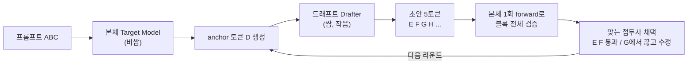
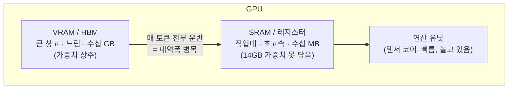

# DSpark & Speculative Decoding

> [!summary] 한 줄 요약
> **본체 가중치는 한 비트도 안 건드리고**, 작은 드래프트(초안) 망을 외부에 부착해 **출력 품질은 동일하게(lossless) 둔 채 추론 속도만 높이는** 기술. `DeepSeek-V4-Pro-DSpark`는 V4-Pro 체크포인트에 이 드래프트 모듈을 붙인 버전이다. 핵심 효용은 **Decode 단계의 메모리 대역폭 병목 완화** — 투자 관점에서는 [HBM](hbm.md) 수요 함수와 직결된다.

---

## 1. 출발점 — DeepSeek-V4-Pro-DSpark는 새 모델이 아니다

> [!fact] 사실 — 동일 가중치 + 드래프트 모듈
> `DeepSeek-V4-Pro-DSpark`는 [DeepSeek](../entities/deepseek.md) **V4-Pro와 동일한 가중치** + speculative decoding용 **드래프트 모듈** 부착본이다. 893GB(표준 V4-Pro 약 865GB)와의 차이 ≈ 28GB가 드래프트 모듈의 무게.

- 본체 사양: 1.6T 총 파라미터(활성 49B), 1M 컨텍스트 [MoE](#6-로컬-구동-사양--활성이-아니라-총량이-메모리를-결정). expert는 FP4, 나머지는 FP8.
- 관련 저장소: **DeepSpec** (드래프트 학습/평가 풀스택 코드, MIT). DSpark·DFlash·Eagle3 세 알고리즘 포함.

---

## 2. Speculative Decoding의 핵심 개념

### 드래프트(draft) = "초안"

> [!fact] 사실 — 비대칭이 이득의 원천
> **드래프트 모델(drafter)**: 본체가 검증할 후보 토큰의 초안을 빠르게 뽑는 작은 신경망(본체의 수십 분의 1). 작은 드래프트로 초안을 싸게 만들고, 비싼 본체는 그 초안 여러 개를 **단 한 번의 forward pass로** 검증한다.

> [!fact] 사실 — lossless의 수학적 근거
> rejection sampling이 타깃 분포를 수학적으로 정확히 보존 → 출력 품질은 본체가 한 토큰씩 생성한 것과 **완전히 동일**. 바뀌는 건 속도뿐이다.

### 디코딩 사이클

> [!info] 효율의 출처
> 효율은 "토큰을 **누가** 뽑느냐"가 아니라 "**비싼 본체를 몇 번 호출하느냐**"에서 나온다. 드래프트가 1개씩 뽑아도 의미 있는 이유: 드래프트가 작아 싸게 뽑고, 본체는 모인 초안을 한 번에 검증 → 본체 호출 횟수가 1/N로 감소.

---

## 3. 왜 빨라지는가 — Decode 단계의 메모리 대역폭 병목

### 추론의 두 단계

| 단계 | 성격 | 병목 | Spec. Decoding 효과 |
|---|---|---|---|
| **Prefill** (입력 처리) | 프롬프트 전체 병렬 처리 | compute-bound | 없음 (안 건드림) |
| **Decode** (출력 생성) | 토큰 1개씩 순차 생성 | **memory-bound** | **여기를 가속** |

### 핵심 메커니즘

> [!fact] 사실 — 가중치 운반 비용은 토큰 수와 무관
> Decode에서 토큰 1개 생성 = 본체의 **거대 가중치 전체를 VRAM→연산유닛으로 운반** → 연산 → 토큰 1개. 시간의 90%+는 **가중치 운반(대역폭)**에 쓰이고, 연산 유닛(텐서 코어)은 놀고 있다. 결정적으로 **가중치 1회 운반 비용은 토큰 1개를 처리하든 5개를 처리하든 거의 같다.** → 드래프트가 5토큰 초안을 깔아두면, 본체는 가중치 **1회 운반**으로 5개를 한꺼번에 검증하고, 추가 연산은 놀던 텐서 코어가 공짜로 처리한다.

> [!warning] 흔한 오해 교정
> - **"남는 GPU 공간에 드래프트를 띄운다" (X)** → 드래프트와 본체는 **한 타임라인에서 번갈아** 돈다. "본체가 매 스텝 낭비하던 연산 여력"을 검증에 돌려쓰는 것.
> - **"첫 토큰 때 가중치 불러오면 그 다음엔 저장해뒀다 바로 쓴다" (X)** → 가중치는 VRAM에 상주하지만, 연산유닛 옆 작업 메모리(SRAM)가 너무 작아 **매 토큰마다 VRAM→연산유닛으로 전부 다시 운반**. "저장해뒀다 바로 쓰는" 건 가중치가 아니라 **KV 캐시**.
> - **GPU 사용률(%) 높음 ≠ 효율적** → 연산유닛이 메모리를 기다리며 도는 것도 "사용 중"으로 잡힌다.

### GPU 내부 메모리 위계

---

## 4. DSpark가 한 일 — 두 축

### 축 1: Semi-Autoregressive(준-자기회귀) 생성

드래프터 설계의 트레이드오프를 결합으로 해결:

| 방식 | 장점 | 단점 |
|---|---|---|
| 자기회귀(AR, 예: EAGLE3) | 토큰 간 의존성 ↑ → 품질 | 드래프트 지연 ∝ 블록길이 → 짧은 블록 |
| 병렬(예: DFlash) | 한 번에 N개 → 빠름 | 위치 독립 예측 → suffix decay (예: "of problem") |

> [!claim] 출처 기반 주장 — DSpark 설계 (DSpark 논문)
> **DSpark = 병렬 백본(속도) + 경량 순차 헤드(품질).** 순차 헤드는 **Markov head**(직전 토큰만 참조, 저랭크 분해 `B = W₁W₂`)가 기본.
> config 매핑: `dspark_block_size: 5`(γ=5), `dspark_markov_rank: 512`, `dspark_target_layer_ids: [58,59,60]`(본체 마지막 3개 레이어 hidden state 주입), `dspark_noise_token_id: 128799`(mask 토큰).
> 만드는 법: **본체 동결 → 본체 출력을 정답지 삼아 드래프트 망(병렬 백본+순차 헤드+confidence head)만 따로 학습.**

### 축 2: Confidence-Scheduled 검증

> [!claim] 출처 기반 주장 — 동적 검증 스케줄
> **confidence head**가 위치별 "생존 확률"을 추정 → Sequential Temperature Scaling으로 보정(ECE 3~8% → ~1%). **하드웨어 인식 스케줄러**가 시스템 부하에 따라 검증 길이를 동적 절단하고, early-stopping으로 lossless를 유지한다. **로컬 단일 사용자에겐 사실상 무의미**(자를 다른 요청이 없음) — 고동시성 프로덕션 전용.

> [!tip] 로컬 vs 프로덕션 효용 분리
> - **축 1 (드래프트)**: 배치 작은 **로컬 단일 사용자에서 효과 최대** → 체감 **속도(latency)** 개선.
> - **축 2 (스케줄러)**: **고동시성 프로덕션 전용** → **처리량(throughput)** 관리.

---

## 5. 성과

> [!claim] 출처 기반 주장 — 벤치마크 (DSpark 논문 / V4 기술 보고서)
> - 오프라인(Qwen3-4B/8B/14B, Gemma4-12B): 채택 길이 기준 **Eagle3 대비 +27~31%, DFlash 대비 +16~18%**. 블록이 길수록 격차 확대.
> - 파라미터 효율: **2레이어 DSpark > 5레이어 DFlash**. 순차 루프 추가 지연 0.2~1.3%에 불과.
> - 프로덕션(DeepSeek-V4 서빙): MTP-1 대비 동일 처리량에서 사용자당 생성 속도 **V4-Pro +57~78%, V4-Flash +60~85%**. 빡빡한 SLA에서 Pareto 프런티어를 바깥으로 밀어냄. V4 프리뷰 공개 2주 만에 MTP-1 대체.

---

## 6. 로컬 구동 사양 — "활성이 아니라 총량"이 메모리를 결정

> [!danger] MoE 메모리 규칙
> 활성 파라미터(49B)는 토큰당 **연산량**만 결정한다. 라우터가 어떤 전문가를 쓸지 미리 모르므로 **전문가 가중치 전체가 VRAM에 상주**해야 한다. → "49B처럼 빠르지만 1.6T처럼 무겁다."

| 모델 | 총/활성 | 로컬 최소 현실 경로 | 맥미니 |
|---|---|---|---|
| Qwen 27~32B급 | 32B / dense | 24GB GPU 1장 (RTX 4090) | 상위 맥미니 가능 |
| V4-Flash | 284B / 13B | 2× H200 또는 256GB+ 통합메모리 Mac | 불가 |
| GLM-5.2 | 744B / 40B | 256GB Mac Studio 또는 4×3090+256GB RAM | 불가 |
| V4-Pro | 1.6T / 49B | 8× H200 단일노드 (데이터센터) | 불가 |

### 핵심 수치

> [!claim] 출처 기반 주장 — 메모리 풋프린트 (커뮤니티/벤더 추정, 분기마다 변동)
> - **V4-Pro 본체**: FP4+FP8 약 862GB. FP16 ≈ 3.2TB / 8bit ≈ 1.6TB / 4bit ≈ 800GB(+KV·오버헤드). 현실 구성: 8× H200(1,128GB) 단일노드 or 2노드(16× H100).
> - **V4-Flash**: 공식 가중치 이미 약 160GB. 13B 활성이라고 13B 모델처럼 다루면 안 됨.
> - **GLM-5.2**: 744B/40B, 1M 컨텍스트. **DeepSeek-V4의 reasoning_effort 재사용 + MTP 3→5 토큰 확장**(speculative decoding 내장). FP8 ≈ 753GB → 8× H200 필요. Unsloth 2bit(UD-IQ2_M) 239GB → 256GB 통합메모리 Mac 또는 24GB GPU+256GB RAM 오프로딩으로 5~15 tok/s.

### 맥미니 ≠ 맥 스튜디오

- 맥미니(최대 64GB)로 V4·GLM-5.2급 **불가**. "맥미니 대란"은 작은 모델(Qwen 27B, Gemma 4) 얘기.
- 애플 실리콘이 거대 모델에 유리한 이유: **통합 메모리(unified memory)** — CPU/GPU가 같은 풀 공유. 512GB M3 Ultra Mac Studio면 GLM-5.2 343GB 양자화본을 15~20 tok/s로 실사용 가능.

### 속도 = 대역폭 / 토큰당 읽는 가중치

> [!fact] 사실 — tok/s를 결정하는 식
> 토큰 생성은 토큰당 활성 가중치 전체를 읽는다. 40B 활성 4bit = 토큰당 20GB 읽기. ÷ 메모리 대역폭 = tok/s. 예: 100GB/s → 5 tok/s. RTX 3090 ≈ 936GB/s. 가중치가 VRAM에 다 안 들어가 시스템 RAM 페이징 시 대역폭이 급락 → 느려진다.

> [!judgment] 내 판단 — 로컬 vs API
> 사지방/스마트폰 환경 + 비용 관점에서 V4·GLM-5.2급은 **로컬이 아니라 API**가 압도적으로 합리적이다. 하드 데이터 거주 요건이나 대량 물량 상각이 없으면 로컬을 돌릴 경제적 이유가 없다.

---

## 7. 투자 관점 연결 — HBM 수요 함수

> [!judgment] 내 판단 — 병목 프레임
> "활성은 작은데 메모리는 총량 전체"라는 MoE 구조 탓에, 모델이 커질수록 연산(FLOPs)보다 **메모리 용량·대역폭([HBM](hbm.md)) 수요가 비선형으로 폭발**한다.

- Decode = 메모리 대역폭 병목 → 추론 칩 성능을 좌우하는 건 FLOPs가 아니라 **[HBM](hbm.md) 대역폭**. ([반도체·AI 칩 가치사슬 종합](../syntheses/semiconductor-ai-chip-value-chain.md)의 "곡괭이와 삽" 논리와 같은 축.)
- Speculative decoding = 하드웨어로 대역폭을 더 사는 대신 **소프트웨어로 대역폭 1단위를 알뜰하게 쓰는** 접근. 같은 병목을 양쪽에서 푸는 셈.
- 로컬 구동 사양표를 거꾸로 읽으면 = **전력 인프라 가치사슬의 수요 함수**. GLM-5.2 한 대 제대로 돌리려 H200 8장 → 데이터센터 전력·냉각·변압기 수요의 출발점.

---

## 8. 관련 노트

**개념 / 하드웨어**: [HBM](hbm.md) · [CoWoS](cowos.md) · [CUDA](cuda.md) · [LLM 서빙 스택 — 계층 구조](llm-serving-stack.md) · [Muon Optimizer](muon-optimizer.md)

**엔티티**: [DeepSeek](../entities/deepseek.md) · [엔비디아 (NVIDIA)](../entities/nvidia.md)

**주제 / 분석**: [중국 반도체 격차 — DeepSeek V4 학습 칩](../topics/china-chip-gap-deepseek-v4.md)

**종합**: [반도체·AI 칩 가치사슬 종합](../syntheses/semiconductor-ai-chip-value-chain.md) — 특히 §6 HBM 축

**도메인**: [AI](../domains/ai.md) · [Finance](../domains/finance.md)

> [!opinion] 출처 신뢰도 주의
> 본 페이지의 성능 배수(+57~78% 등)·메모리 풋프린트·로컬 사양 수치는 대부분 V4 기술 보고서·DSpark 논문·커뮤니티 추정에 기반하며 모델 리비전마다 바뀐다. 메커니즘(memory-bound decode, rejection sampling lossless)은 `confidence: high`이나, 구체 수치는 `medium` 이하로 취급하고 인용 시 원 출처·날짜를 재확인할 것.
