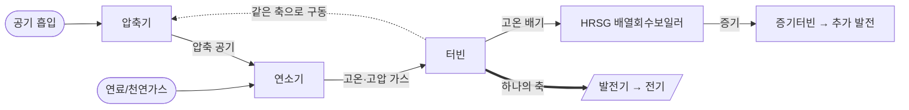
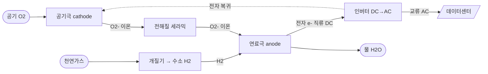
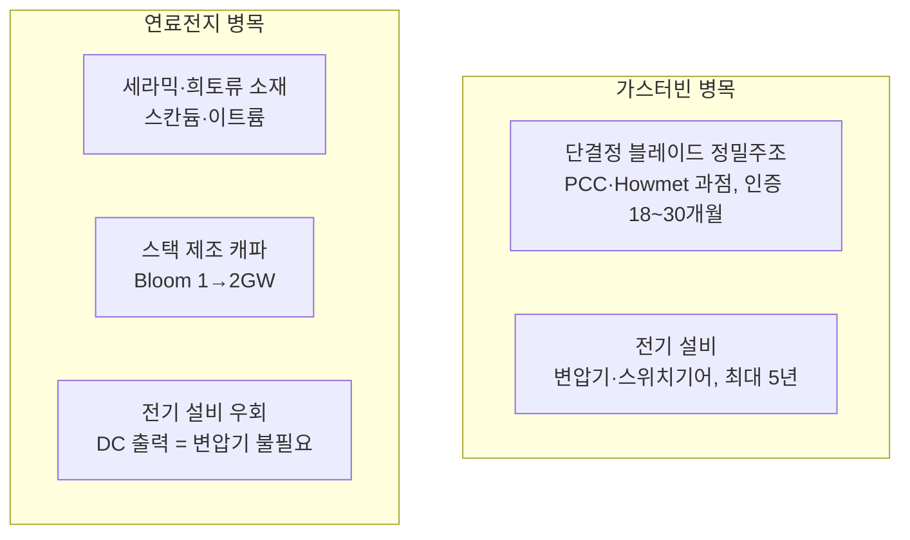
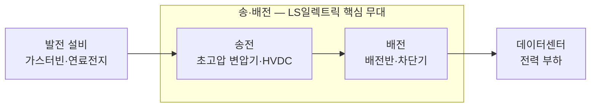

# AI 데이터센터 전력 인프라 종합

AI 데이터센터의 전력 확보 경쟁을 **발전(가스터빈·연료전지) → 송·배전(변압기·전력기기) → 부하(DC)** 의 한 가치사슬로 종합하고, **투자·판단 관점에서 어디에 병목·협상력·마진이 집중되는지**를 정리한 페이지. [반도체·AI 칩 가치사슬 종합](semiconductor-ai-chip-value-chain.md)의 자매편 — 칩이 컴퓨팅의 공급이라면, 전력은 그 칩을 돌리는 에너지의 공급이다.

> [!summary] TL;DR
> 계통 연결이 5~7년씩 걸리면서 데이터센터가 **전력망을 우회한 자가발전(behind-the-meter, BTM)** 으로 이동 중. 발전(가스터빈·연료전지)과 송·배전(변압기·배전반)이 **동시에** 병목이 되었고, **병목의 위치가 곧 가격 결정력**이다. 핵심 경쟁축은 효율이 아니라 **속도(speed to power)**. 가스터빈은 [GE Vernova](../entities/ge-vernova.md)·Siemens·Mitsubishi 빅3가 ~2/3 과점하고 [두산에너빌리티](../entities/doosan-enerbility.md)가 납기로 추격, 연료전지는 [Bloom Energy](../entities/bloom-energy.md)가 변압기 병목을 우회하며 침투, 송·배전 전력기기는 [LS일렉트릭](../entities/ls-electric.md) 등 K전력기기 빅3가 미국 공급부족 틈을 공략한다.

> [!principle] 관통 원리 — 리드타임이 가장 강력한 병목이자 차익거래의 원천
> 데이터센터는 **MW당 연 1,000만~1,200만 달러** 매출을 낸다. 가동을 몇 년 앞당기면 수백억 달러 차이. 따라서 발전 효율의 비효율(수백만 달러)은 기꺼이 감수한다 → 왕복엔진·비전통 공급자 같은 **비효율적 대안까지 동원**된다. "효율이 아니라 속도"라는 이 비대칭이 이 산업 전체의 의사결정을 지배한다.

---

## 0. 핵심 숫자 (한눈에)

| 구분 | 핵심 숫자 |
|---|---|
| 미국 BTM 천연가스 발표 용량 | **~101 GW** (장비 발주 57GW, 건설 7GW) |
| CCGT 건설비 | <$1,500/kW(2023) → **$2,157/kW**(2025), +66% |
| 가스터빈 장비 단가 | 2019 대비 +195%(2026말), **~$600/kW**(2027말, ≈3배) |
| 글로벌 OEM 연 생산능력 | **~60 GW** (수요 대비 부족 = 병목) |
| 리드타임 | 발표→운전 최대 **7년**, 슬롯 2030년대 초까지 매진 |
| 가스터빈 시장규모 | $22.6B(2025) → $64.8B(2035), CAGR 11.2% (GMI) |
| Bloom 연료전지 수주 | **90일간 $7.65B** (2026 초) |
| LS일렉트릭 1Q26 | 매출 1.38조, 영업익 1,266억, **OPM 9.2%** |
| K전력기기 빅3 OPM(1Q26) | HD현대 **24.9%** > 효성 13.4% > LS 9.2% |

> [!opinion] 출처 신뢰도 주의
> 본 페이지의 용량·가격·점유율·수주 수치는 대부분 업계 추정·기업 발표(`confidence: medium~low`)다. 90 GW/59개 프로젝트 중 92%가 2025년 이후 발표 → 상당수 미검증. 인용 시 원 출처와 날짜를 반드시 재확인할 것.

---

## 1. 큰 그림 — 왜 자가발전(BTM)인가

> [!fact] 사실
> ERCOT(텍사스)는 2026.3 기준 **약 356 GW**의 데이터센터 연결 요청을 접수했다. 글로벌 가스화력 개발 용량은 2025년 +31% → **1,047 GW**(텍사스만 80.6 GW). 미국 천연가스 발전 비중은 ~43%(2023)→~37%(2024).

- 전통적으로 데이터센터는 전력망에 100% 의존 → 최근 계통 대기열이 5~7년으로 폭증.
- 1년 전만 해도 자가발전은 xAI가 멤피스에 이동식 발전기를 트럭으로 들여온 정도의 틈새였으나, 지금은 거의 모든 하이퍼스케일러가 추진하는 **주류 전략**.
- 계통 대기열 압박 자체가 오히려 자가발전을 부추기는 **양의 되먹임**.

> [!judgment] 내 판단 — "녹색의 즉시성"보다 "전력의 속도"
> 하이퍼스케일러는 100% 재생에너지 목표를 내걸면서도 실제로는 속도를 우선한다. 그래서 수소 혼소 대응(hydrogen-ready) 가스터빈을 깔며 "미래에 전환 가능한" 과도기 플랫폼으로 설계한다 — ESG 명분과 실물 제약 사이의 타협. 이 모순을 읽으면 "재생에너지 선언"을 가스터빈 발주의 반대 신호로 오해하지 않게 된다.

---

## 1.1 SemiAnalysis 보강 — grid headroom이 BTM을 강제한다 (2026-06-25)

[SemiAnalysis의 2026-06-25 리서치](../../sources/semianalysis-us-grid-constraints-btm-datacenter-2026.md)는 이 페이지의 BTM 논지를 **계통 headroom 모델**로 보강한다. 핵심은 데이터센터 전력 수요가 빠르게 늘어도 계통이 인정할 수 있는 accredited capacity가 같은 속도로 늘지 않는다는 점이다.

> [!claim] 수요 vs 계통 공급의 속도 차이
> SemiAnalysis는 미국 데이터센터 gross power demand가 2026년 **+21GW**에서 2030년 **+84GW**로 커지는 반면, 미국 계통이 추가하는 net-new **ELCC** 용량은 연 **약 15GW** 수준에 그친다고 주장한다. 그 결과 2028년 이후 신규 미국 데이터센터의 **절반 이상**이 BTM으로 이동하고, 2029년 DC BTM 장비 TAM이 **연 50GW+**를 넘을 수 있다는 전망을 제시한다.

> [!fact] ELCC/headroom 프레임
> 데이터센터가 계통에 붙을 수 있는지는 nameplate 발전량이 아니라 `accredited supply - peak demand - required reserves`로 계산되는 **grid headroom**에 달려 있다. 태양광·풍력·BESS는 nameplate 증설이 커도 출력 상관관계와 duration 한계 때문에 incremental ELCC가 낮아질 수 있다.

> [!claim] 2027년부터 headroom이 빨간색으로 바뀐다
> SemiAnalysis는 주요 미국 subregion의 headroom이 이미 0에 접근했고 2027년부터 reserve margin target 아래로 내려가는 지역이 늘어난다고 본다. PJM 2027/2028 BRA 예시에서는 약 **134,478MW UCAP**이 clearing되었지만 target 20% 대비 reserve margin 14.4%, 약 **6,517MW UCAP** deficit으로 설명된다.

> [!judgment] 내 판단 — BTM은 선택지가 아니라 일정 리스크 헤지
> 이 보강 자료를 넣으면 BTM의 의미가 더 선명해진다. BTM은 단순히 전기를 싸게 사는 방법이 아니라, **utility interconnection 일정이 2030년으로 밀릴 리스크를 데이터센터 운영자가 직접 통제하는 헤지**다. AI workload의 power value가 매우 크고 일부 workload가 five nines uptime을 요구하지 않는다면, 계통 신뢰도 프리미엄보다 2027~2028년 energization 확실성이 더 큰 가치가 된다.

## 2. 가스터빈 — 작동 원리부터 병목까지

### 2.1 브레이튼 사이클 (Brayton cycle)

핵심: **압축 → 연소 → 팽창**, 그리고 **하나의 축(shaft)** 에 압축기·터빈·발전기가 물려 있음. 터빈 회전력의 일부가 다시 압축기를 돌리고, 나머지가 발전기를 돌린다.

- **단순 사이클(OCGT)**: 배기를 그냥 버림. 효율 35~45%. 증설·기동 빠름.
- **복합 사이클(CCGT)**: 배기열로 증기 만들어 증기터빈 한 번 더 돌림 → 효율 **63%+** (두 번 돌리기).

> [!fact] 사실 — 왜 빠른 증설이 불가능한가
> 엔지니어링 난제는 터빈 블레이드다. **합금 융점의 약 90% 온도**에서 작동 → 내부 냉각 채널이 필요 → 통짜 가공 불가, **단결정 정밀주조(investment casting)** 만 가능. 이 제조 기법이 곧 공급 탄력성을 막는 물리적 한계다.

### 2.2 규모·가격

- H/HA급 단순 사이클 약 **380 MW/기**. (예: 뉴멕시코 Project Jupiter는 단순 사이클만으로 2,880 MW)

| 항목 | 2023 | 2025/26 | 변화 |
|---|---|---|---|
| CCGT 건설비 ($/kW) | <$1,500 | $2,157 | **+66%** |
| 건설 기간 | 기준 | — | +23% |
| 가스터빈 장비(2019 대비) | — | +195%(2026말) | 발전소 원가의 최대 30% |
| 터빈 $/kW | — | **~$600(2027말)** | ≈2019의 3배 (Wood Mackenzie) |

> [!judgment] 병목 = 해자, 단 진짜 병목의 위치를 혼동하지 말 것
> 제조 기법상 빠른 증설이 불가능 → 대기 명단이 2030년대 초까지. **공급 제약 자체가 점유율을 방어**한다. 단, [GE Vernova](../entities/ge-vernova.md) CEO는 "EPC·인허가·연료 조달을 보면 터빈이 진짜 율속 단계는 아닌 경우가 많다"고 언급했다. → 실제 병목은 완제품 OEM이 아니라 **상류의 단결정 블레이드 주조 + 하류의 전기 설비(변압기·스위치기어)** 다. 이것이 §5의 LS일렉트릭 논지와 직접 연결된다.

### 2.3 플레이어 — 빅3가 글로벌 수요의 약 2/3

| 기업 | 시총(약) | 핵심 |
|---|---|---|
| **[GE Vernova](../entities/ge-vernova.md)** | $162B | 가스 백로그+예약 100GW(1Q26)→110GW 목표, 총 백로그 $163.3B, 美 1위, 세계 전력 ~25% 담당, HA급 2030까지 매진 |
| **Siemens Energy** | $91B | 사상 최대 백로그 €154B, 대형터빈 연 48→70~80기 |
| **Mitsubishi HI** | $84B | 2년간 생산능력 2배, M701JAC(수소대응) 카타르 2.4GW |

> [!claim] 출처 기반 주장 — 장비 점유율 (2025, GMI)
> GE Vernova 18.5% 선두, 상위 5사(Ansaldo·Mitsubishi·GE·Siemens·Baker Hughes) 합산 64.5%. 각 빅3는 ~5년치 수주잔고를 깔고 있다.

**[두산에너빌리티](../entities/doosan-enerbility.md) — 한국의 빠른 추격자**

> [!claim] 출처 기반 주장
> H급 가스터빈을 자체 개발한 **5번째 국가**(단순 380MW / 복합 63%+). 핵심 무기는 **납기** — 빅3 평균 5년(최대 7년) vs 두산 **1~2년**. 누적 23기(국내 11 + 해외 12), 1Q26만 10기 수주(국내 3 + 美 빅테크 7, 美 발주 5기는 모두 xAI향). 생산능력 연 6 → 8('27) → 12기('28), 2038년 누적 105기 목표. 서비스는 터빈 1기당 연 ~100억 원 × 14년+.

> [!fact] 사실 — 비전통 대안(왕복엔진)까지 동원
> 터빈을 못 구한 개발사들이 왕복엔진으로 이동. INNIO–VoltaGrid 2.3 GW(오라클, 25MW×92팩), Titus는 Jenbacher 왕복엔진(급격한 부하변동 관리 유리) 채택. 한 개발사는 발전 제품 무경험사인 Boom Supersonic에 $1.25B를 발주했다 — §0의 "효율보다 속도" 원리가 만든 극단 사례.

### 2.4 가치사슬 — 진짜 병목은 상류의 정밀주조

| 계층 | 세부 시장 | 핵심 플레이어 | 기회 / 반응 |
|---|---|---|---|
| 소재 | 초내열 Ni 초합금 (CMSX-4, Rene N5) | PCC, Howmet, Hitachi Metals | Ni·Co·Re ±20~35% 변동 → 마진 압박; 저임계원소 합금 R&D |
| **부품(병목)** | 단결정 블레이드·베인 정밀주조 | **Precision Castparts(버크셔)**, **Howmet**, Doncasters, CPP | 블레이드 = 엔진 원소재비 **35%**; **인증 18~30개월 = 진입장벽** |
| 부품 | 열차폐코팅(TBC)·단조 링 | 코팅 전문사 | 초합금+코팅 = 조립 원가 30~45% |
| 시스템 | 완제품 OEM | GE Vernova/Siemens/Mitsubishi/두산 | 가격 결정력 폭발 |
| 시스템 | 전기 BOP (발전기·HRSG·승압변압기·스위치기어) | GE Vernova 전기화, Prysmian, Powell | GE 전기화 수주 2배 $7.1B, DC向 $2.4B(Q1) |
| 서비스 | LTSA·부품 | 전 OEM | 가장 안정적 수익 풀 |
| 연료 | 천연가스 파이프라인 | Williams, Kinder Morgan | On-site 발전의 물리적 전제 |

> [!tip] 곡괭이와 삽 (반도체편과 같은 원리)
> 단결정 블레이드 시장은 $543M(2025)→$865M(2032, CAGR 6.86%)로 작지만, **버크셔(PCC)·Howmet 과점 + 18~30개월 인증 장벽**이 가장 단단한 해자다. OEM 누가 이기든 블레이드는 이 소수에게서 산다. 반도체의 [ASML·TSMC](semiconductor-ai-chip-value-chain.md) 자리와 같은 구조.

---

## 3. 연료전지 (SOFC, 고체산화물)

### 3.1 작동 원리 — 회전부도, 연소도 없다

데이터센터용은 대부분 **SOFC**. 가스터빈과 정반대로 **움직이는 부품이 0개**. 연소 없이 화학 반응으로 전기를 직접 추출한다.

- 공기극에서 산소가 전자를 받아 **산소이온(O²⁻)** → 세라믹 전해질 통과 → 연료극에서 수소(개질기가 천연가스 분해)와 만나 물 + 전자 방출. 갈 곳 잃은 전자가 **외부 회로**를 도는 것이 전류(DC).
- 작동 온도 **800~1000°C** → 고가 세라믹·희토류 필요, 출력이 DC라 인버터 필수.
- 장점: 무연소(NOx·CO 0), 정숙(도심·실내 가능), 효율 50~65%(OCGT 35~45% 대비 10~30%↑).

### 3.2 가치사슬 — 세라믹·희토류 의존

| 계층 | 세부 시장 | 핵심 소재/플레이어 | 기회 / 반응 |
|---|---|---|---|
| **소재(병목)** | 세라믹 전해질 (YSZ·ScSZ·GDC) | 지르코니아 + 이트륨/스칸듐/세륨 | **거의 모든 구성요소에 희토류**; 희토류 분리비용·공급망 = 구조적 리스크 |
| 소재 | 전극 (연료극 Ni-YSZ, 공기극 LSM/LSCF) | 니켈+세라믹, 란타넘·스트론튬·코발트 | 저온서 저렴한 LSM 쓰려는 소재 최적화 |
| 부품 | 인터커넥트 | **Plansee** — 크롬-철-이트륨(CFY) 분말야금 | 특수 금속·분말야금 니치 |
| 부품 | 고온 실링 | **Schott** — 유리 실링재 | 고온 기밀이 수명 관건 |
| 시스템 | 셀·스택 제조·통합 | **[Bloom Energy](../entities/bloom-energy.md)**(수직통합) | 캐파가 병목: 1→2GW('26말) |
| 시스템 | 전력변환 (인버터·BOP) | Vertiv | DC 출력이라 인버터 필수 |
| 연료 | 개질기 + 천연가스(향후 수소) | 동일 가스 인프라 | 녹색수소 $2/kg 미만 돼야 무탄소 경제성 |

> [!judgment] 변압기 우회 = 이 페이지에서 가장 중요한 한 줄
> 연료전지는 **저전압 직류를 직접 출력** → 고압(HV)·중압(MV) 변압기가 **불필요**하다. 즉 §5에서 다룰 변압기·스위치기어 병목을 **통째로 건너뛴다.** 2026년 미국 DC 12GW 중 착공은 5GW뿐이고 율속 요인이 HV 변압기·스위치기어인데(전기 설비는 총비용 10% 미만이지만 병목의 100%), 연료전지는 이 율속 단계를 우회한다. → 오라클 Project Jupiter에서 일부 가스터빈 슬롯 취소·Bloom 전환 정황이 포착됐다. 이것이 연료전지의 진짜 경쟁력이 효율이 아니라 **병목 우회 = 속도**임을 보여준다.

### 3.3 가스터빈 vs 연료전지

| 항목 | 가스터빈(단순) | SOFC |
|---|---|---|
| 발전 효율 | 35~45% | **50~65%** |
| CapEx(명판) | 기준 | 10~15%↑ |
| 연료 소비 | 기준 | 15~20%↓ |
| LCOE (가스 $4/MMBtu) | 기준 | ~40%↑ |
| LCOE (가스 $13.3/MMBtu) | 기준 | 대등~7%↓ |
| 배출·소음·인허가 | 연소·소음 부담 | 무연소·정숙·인허가 용이 |

> [!judgment] 내 판단 — 둘은 경쟁이 아니라 분업이다 ([반도체편 GPU vs ASIC](semiconductor-ai-chip-value-chain.md)과 동형)
> 연료전지 경쟁력은 가스 가격에 민감하다(美 저가 가스 → 가스터빈 유리 / 유럽·아시아 고가 → 연료전지 유리). 하지만 실제 채택 이유는 **비가격(속도·청정·지역수용성)** 이다. 둘 다 수주가 만석이고 수요가 양쪽을 합쳐도 부족하므로, "대체"가 아니라 **부지 특성에 따른 분화**로 간다: 도심·인허가 까다로운 부지=연료전지, 외곽 저비용=가스터빈. 자가발전 100% 의존 DC 비중은 1년 전 1% → **2030년 27%**로 전망된다.

### 두 병목 지도 (종합)

---

## 4. 시장 규모·점유율 전망

> [!claim] 출처 기반 주장 — 시장 규모
> 가스터빈: GMI $22.6B(2025)→$64.8B(2035, CAGR 11.2%); Precedence $30.24B→$61.13B(7.29%). 대체로 10년 2배+. EIA는 가스화력 발전이 2026 횡보 → 2027 가속할 것으로 본다. 글로벌 DC 전력은 2030년 ~4배 1,260 TWh, 그 중 천연가스 발전 ~870 TWh.

> [!judgment] 3가지 예측 (경제학 렌즈)
> 1. **2030까지 가스터빈 지배는 거의 확정** — 기술이 아니라 병목 때문. 만들 수 있는 양(~60GW/년)이 한정 → "팔 수 있는 만큼 다 파는" 시장.
> 2. **연료전지는 '대체' 아닌 '확장'** — 둘 다 수주 만석(가스터빈 '29까지), 수요가 양쪽 합쳐도 부족. 부지 특성으로 분화.
> 3. **장기 리스크 = 효율 곡선 방향** — 태양광·배터리는 싸지고 가스터빈은 비싸짐. 2030년대 중반 병목이 풀리고 청정 대안 비용이 내려가면 가스 증분 점유율은 정점을 찍는다. **즉 지금의 호황은 구조가 아니라 병목이 만든 한시적 렌트일 수 있다.**

> [!claim] Goldman 전망
> 2024~30 DC 증분 수요 730 TWh 중 **1/4~1/3을 BTM**, 그 중 **연료전지 6~15%**, BTM 최대 25 GW/5년. → 가스터빈이 절대량을 쥐되 연료전지가 변압기 우회 강점으로 빠르게 침투.

---

## 5. 송·배전 전력기기 — [LS일렉트릭](../entities/ls-electric.md) & K전력기기 빅3

발전 설비가 만든 전기는 **송전(전압↑) → 배전(분배)** 을 반드시 거쳐 부하로 간다. 이 전기 BOP(Balance of Plant) 계층이 §2.2에서 지목한 또 하나의 진짜 병목이다.

> [!fact] 사실 — 구조적 공급부족
> 美 배전 변압기 70%가 수명(25년)을 초과했고, 송전망 대부분이 1950~60년대 설비다. 여기에 AI DC 신규 수요가 겹쳤다. 미국 변압기 자급률은 **20%**, 평균 납기 **~143주** → 명백한 공급자 우위 시장. DC 전력 인프라 시장은 86.5억(2025)→372억 달러(2035, CAGR 16%).

### 5.1 국내 빅3 — 같은 호황, 다른 베팅

> [!important] 핵심: 같은 호황이라도 **무엇을 파느냐가 마진을 가른다**

| 구분 | LS일렉트릭 | HD현대일렉트릭 | 효성중공업 |
|---|---|---|---|
| 2025 매출 | 4.96조 | 4.08조 | 5.97조(건설 포함) |
| 2025 영업이익 | 4,269억 | 9,953억 | 7,470억 |
| **1Q26 영업이익률** | 9.2% | **24.9%** | 13.4%(중공업) |
| 주력 | 배전+자동화, 송전 확대 | **초고압 변압기 집중** | 초고압 변압기+건설 |
| 해외 비중 | ~50% | 60~70% | 60~70% |
| 미국 거점 | 유타 MCM·텍사스 Bastrop | 앨라배마(최초) | 테네시 멤피스(765kV) |

> [!judgment] 내 판단 — 마진을 가른 것은 사이클이 아니라 '제품 믹스'
> HD현대는 '가장 비싼 시장(북미·중동)에서 가장 비싼 제품(초고압 변압기)을' + **선별 수주**로 애플급 24.9% OPM을 냈다(룰메이커 전략). 효성은 멤피스 765kV 미국 최대 거점·1Q26 수주 4.17조(역대 최대)·잔고 15.1조로 외형은 최대지만 건설이 마진을 희석한다. [LS일렉트릭](../entities/ls-electric.md)은 "넓지만 얕은" 모델 — 최광폭 포트폴리오·국내 DC 1위·풀패키지가 강점, 해외비중 50%·낮은 마진(고마진 UHV 비중이 낮았던 결과)이 약점. **단 빠르게 보완 중**: 부산 UHV 캐파 2,000억→6,000억(3배), 잔고 내 UHV 비중 41.7%→55%(1.6조→3.1조).

### 5.2 글로벌 메이저 — 체급이 다르다

> [!claim] 출처 기반 주장
> 스위치기어 톱5(ABB·Siemens·GE·Schneider·Eaton) ~35~40%. DC 전력 톱5(Schneider·Vertiv·ABB·Eaton·Delta) 41~43%. 매출 체급은 Schneider ~€34.5B, Siemens ~€78B, Eaton ~$27B vs **LS ~5조 원(≈$3.5B)** — 한 자릿수 배 차.

> [!judgment] LS의 현재 위치 = "가성비 아시아 추격자"
> LS는 글로벌 분류상 CHINT·Delixi와 동급(프리미엄 대비 30~50% 저렴, 보증·장기신뢰성은 편차). 무기는 **빠른 납기·가격으로 美 공급부족 틈 공략**(2020~25 美 100+ 프로젝트). 즉 두산이 가스터빈에서 쓰는 "납기 추격자" 전략을 LS가 전력기기에서 그대로 구사한다 — K-인프라의 공통 진입 공식.

### 5.3 종합 평가 — LS일렉트릭

- **강점**: ① 송·배전 포트폴리오 폭(풀패키지) ② 국내 DC ~70% 내수 지배력 ③ HVDC·DC 차세대 선제 기술(국내 최초 500MW급 전압형 변환기) ④ 美 현지화·가성비.
- **약점/리스크**: ① 낮은 수익성(9.2% vs HD현대 24.9%) ② 낮은 해외비중(50%) ③ 글로벌 대비 작은 체급·브랜드 ④ 빅3 증설 경쟁 → 중장기 공급과잉·주가 부담.
- **관전 포인트**: UHV 비중을 끌어올려 **마진 격차를 얼마나 빨리 좁히느냐** + 해외비중을 경쟁사 수준(70%)에 근접시키느냐.

---

## 6. 핵심 통찰 (경제학 관점)

> [!judgment] 가치사슬을 관통하는 5개 원리
> 1. **병목 = 해자**: 좁은 병목 + 긴 인증 장벽 = 가격 결정력. 단결정 주조(PCC/Howmet), 대형 변압기(5년 리드), 희토류 세라믹, 인터커넥트 특수합금.
> 2. **효율이 아니라 속도**: MW당 연 $10~12M 매출 앞에서 발전 효율 비효율은 무시된다 → 비효율적 대안까지 동원.
> 3. **서비스가 수익 풀**: 가스터빈 LTSA / 연료전지 스택 교체·O&M = 가장 안정적·반복적.
> 4. **반응(공급 확장)은 전방위**: Siemens·Caterpillar·Mitsubishi·두산·Bloom 모두 증설 → 2030년대 중반 공급과잉 가능성 = 사이클 정점 리스크.
> 5. **병목 우회가 곧 경쟁력**: 연료전지의 변압기 우회처럼, 누가 병목 한 칸을 건너뛰느냐가 점유율을 가른다.

이 5개 원리는 [2×2 경제 환경 프레임](../principles/economic-quadrants.md)·[반도체 가치사슬 6원리](semiconductor-ai-chip-value-chain.md)처럼 **개별 전력 종목 뉴스를 끼워 넣을 체크리스트**로 쓴다 — 어떤 전력 인프라 뉴스를 보든 "이건 어느 병목의 사례인가"를 먼저 묻는다.

---

## 7. 다음 학습 주제 (Open Questions)

- [ ] 단결정 블레이드 정밀주조가 왜 18~30개월 인증을 요구하는가 (결정 결함·크리프 수명의 물리)
- [ ] 수소 혼소(hydrogen co-firing) 상용화 시점과 NOx 영향
- [ ] HVDC 전압형(VSC) 변환기의 구조와 LS의 기술 위치
- [ ] 가스 가격 시나리오별 가스터빈↔연료전지 LCOE 역전 지점
- [ ] BTM 발표 용량(~101GW)의 실현율 — 92%가 2025 이후 발표, 얼마나 건설로 이어질까
- [ ] K전력기기 빅3의 미국 캐파 증설 vs 글로벌 메이저 증설의 공급과잉 타이밍

---

## 8. 관련 노트

**엔티티**: [GE Vernova](../entities/ge-vernova.md) · [두산에너빌리티](../entities/doosan-enerbility.md) · [Bloom Energy](../entities/bloom-energy.md) · [LS일렉트릭](../entities/ls-electric.md)

**자매 종합**: [반도체·AI 칩 가치사슬 종합](semiconductor-ai-chip-value-chain.md) — 컴퓨팅 공급 vs 전력 공급

**원칙/프레임**: [2×2 경제 환경 프레임](../principles/economic-quadrants.md)

**도메인**: [Finance](../domains/finance.md) · [AI](../domains/ai.md)

**Watchlist 뉴스 (루틴, `confidence: low`)**: [GE](../news/tickers/GE%20-%20GE%20Aerospace.md) · [VST](../news/tickers/VST%20-%20Vistra%20Corp.md) · [CEG](../news/tickers/CEG%20-%20Constellation%20Energy.md) · [CAT](../news/tickers/CAT%20-%20Caterpillar%20Inc.md)

**원본**: [sources/ai-datacenter-power-infrastructure.md](../../sources/ai-datacenter-power-infrastructure.md)
